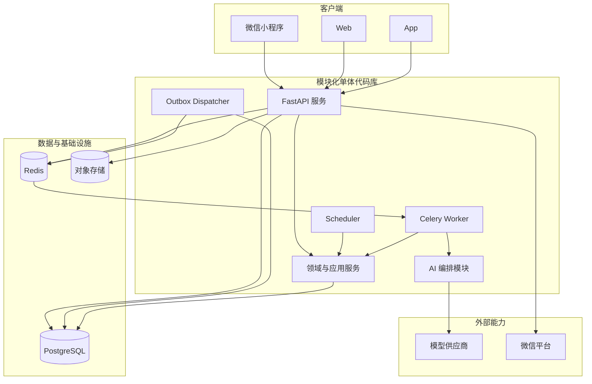

# 砚田日耕 AI 规划系统技术方案

> 版本：高层方案 v0.3  
> 日期：2026-07-13  
> 依据：[AI 规划系统设计](./ai-system-design.md)  
> 当前范围：确定总体技术方向、系统边界和关键运行机制；表结构、状态机、命令协议、API 与异步参数见 `ai-technical-details/`。  
> 文档权威：本文件与 `ai-system-design.md` 共同作为新项目依据；旧原型和旧方案文档不再约束实现。

## 一、技术目标

本项目按新系统从零设计，不继承现有原型的代码、数据结构或部署约束。

完整客户端目标覆盖微信小程序、Web 和 App，并通过同一套后端能力接入。系统按数千至数万用户规模设计，在保证可靠性的同时避免过早引入微服务和复杂基础设施；具体交付顺序后续另行设计。

技术方案需要支持：

- 长期目标、阶段、主推进里程碑、两周计划与任务的持久化管理；
- 初始规划、周滚动、事件驱动重规划和剩余路线校准；
- AI 结构化建议与确定性业务规则分离；
- 固定使用 `Asia/Shanghai` 进行自然周结算；
- 耗时 AI 操作异步执行并可重试；
- 多端共享统一 API；
- AI 调用、自动调整和用户确认均可追踪、可解释、可恢复；
- AI 不作为用户能力认证平台。

---

## 二、核心技术决策

### 2.1 前后端分离

采用“统一后端 API + 多端客户端”模式：

```text
微信小程序
Web（后续）
App（后续）
        ↓
统一 REST / JSON API
        ↓
AI 规划与业务系统
```

规划、权限、状态流转和数据一致性全部由后端负责。客户端只负责平台认证接入、展示、输入和交互，不在本地维护独立的规划真相。

前后端分离不等于微服务，也不要求多个代码仓库。当前默认采用一个主代码库，并通过清晰模块边界保证后续拆分能力。

### 2.2 模块化单体

后端采用模块化单体，而不是微服务：

- 一个 API 服务；
- 一个或多个异步 Worker；
- 一个定时调度进程；
- 三者共享领域模型和业务代码；
- 模块之间通过应用服务接口协作，不直接跨模块修改数据。

当单一模块出现独立扩缩容、故障隔离或团队边界需求时，再从模块化单体中拆出服务。

### 2.3 Python 技术栈

后端使用 Python，主要考虑 AI 编排、结构化输出校验、材料处理和开发效率。

首选组件：

- Web 框架：FastAPI；
- 数据模型与校验：Pydantic 2；
- ORM：SQLAlchemy 2；
- 数据库迁移：Alembic；
- 关系数据库：PostgreSQL；
- 异步任务：Celery；
- 队列与短期状态：Redis；
- 测试：pytest；
- 对象存储：S3 兼容服务；
- 部署：Docker。

模型供应商通过统一网关接入，业务模块不直接依赖具体供应商 SDK。

---

## 三、总体架构



部署时 API、Worker、Scheduler 和 Outbox Dispatcher 是独立进程，但仍属于同一套应用和同一代码库。

---

## 四、后端模块边界

### 4.1 身份与用户模块

负责：

- 内部用户账号；
- 微信身份绑定；
- 后续 Web/App 登录方式；
- 总周容量、稳定偏好和通知设置。

当前完整方案只服务中国用户，业务日期、自然周和调度统一使用 `Asia/Shanghai`，不提供用户时区切换。

平台身份与内部用户分离，避免未来增加 Web/App 登录时重构业务表。

### 4.2 规划领域模块

系统核心模块，负责：

- 项目和长期目标；
- 阶段与里程碑路线；
- 每个项目唯一的主推进里程碑；
- 用户周总容量与各项目周预算；
- 执行周与预备周；
- 任务及其来源关系；
- 周滚动；
- 事件驱动重规划；
- 剩余路线校准；
- 调整权限与用户确认。

该模块拥有规划业务数据的最终修改权。

### 4.3 任务与反馈模块

负责：

- 本周任务池、推荐顺序、依赖与截止查询；
- 完成、跳过、取消、替换和耗时事件；
- 用户对困难、容量和方向的反馈；
- 单次事件、稳定偏好和目标修正的候选分类。

单个任务状态变化通常只记录事件，不立即调用 AI 或重建本周计划。

反馈分类不能只依赖模型。涉及目标、截止、长期容量或项目优先级的分类与变更必须经过确定性规则识别，并由用户确认后生效。

### 4.4 AI 编排模块

负责：

- 构建工作流所需上下文；
- 调用模型网关；
- 校验结构化输出；
- 生成候选规划变更；
- 保存模型、提示词、耗时、费用和失败信息。

AI 编排模块只能生成建议，不能直接修改项目、里程碑、周计划和任务。

### 4.5 材料模块

负责：

- 材料上传与访问控制；
- 文件元数据；
- 异步文本提取与摘要；
- 与项目和规划运行的引用关系。

原始文件存放在对象存储，数据库只保存元数据、解析结果与引用。

### 4.6 通知模块

负责：

- 微信订阅消息；
- 通知模板和发送记录；
- 失败重试；
- 后续邮件、App Push 等渠道适配。

---

## 五、核心领域对象

### 5.1 业务真相

以下对象属于 PostgreSQL 中的可信业务状态：

- `User`：内部用户；
- `UserIdentity`：微信及未来平台身份；
- `UserPreference`：总容量和稳定偏好；
- `UserWeekCapacity`：用户某个自然周的总容量、安全可分配容量和使用汇总；
- `UserWeekAllocationSet`：该周一次不可变的项目预算版本；重新分配创建新 revision；
- `UserWeekAllocation`：某个分配版本内给单个项目的预算条目；
- `UserWeekRun`：按 rollover、reallocation 或 recovery 类型协调基线晋升、容量分配和项目周滚动；
- `Project`：一个长期目标或持续成长方向；
- `Stage`：路线中的主要阶段；
- `Milestone`：阶段中的进展节点；
- `WeekPlan`：执行周或预备周；
- `Task`：具体行动；
- `TaskDependency`：客观不可反转的任务硬前置关系；阻塞状态由此派生；
- `TaskEvent`：任务状态变化和用户记录；
- `ProjectWeekAssessment`：项目每周结构化评估，支撑最近 2—3 周趋势；
- `ProjectClosureSnapshot`：项目到期关闭时生成的不可变结算快照；
- `UserFeedback`：用户反馈及其影响范围；
- `Material`：用户材料及解析状态；
- `Notification`：通知计划与发送结果。

每个项目同一时间只有一个主推进里程碑。已转入后续的历史里程碑冻结，不参加每周重算。仍需保留的内容转成普通复习或补救任务。

容量以预计分钟规划，actual_minutes 仅保存用户明确记录的真实耗时并用于后续估算校准。完成状态、实际耗时和“轻松/合适/吃力”反馈分开保存；不引入虚拟能量条或不透明消耗值。

### 5.2 AI 与决策记录

- `PlanningRun`：一次 AI 工作流运行；
- `PlanningSnapshot`：该次运行使用的输入快照；
- `PlanningProposalSet`：一次模型响应及其权限拆批集合；
- `PlanningProposal`：集合内一个通过结构校验、可原子应用的权限批次；
- `DomainCommand`：PlanningProposal 中经过白名单约束的领域命令；
- `ProposalDecision`：自动应用、待确认、接受、拒绝或失效结果；
- `ModelInvocation`：模型、提示词版本、token、费用、延迟与错误。
- `OutboxMessage`：业务事务提交后等待可靠投递的消息。

这些对象用于审计、重试和解释，不直接等于已经生效的业务状态。

在具体表设计阶段，可以根据查询和事务边界将部分逻辑对象合并到同一张表或 JSONB 字段中，但逻辑职责保持分离。

---

## 六、AI 编排设计

### 6.1 有限工作流

完整方案不构建可以无限循环和自主调用工具的通用 Agent。按业务场景设计有限工作流：

- `GoalUnderstanding`：理解目标并识别缺失信息；
- `InitialPlanning`：生成阶段、里程碑和两周计划；
- `WeeklyReview`：评估主推进里程碑并滚动计划；
- `EventDrivenReplanning`：重大事件发生后的即时影响评估和两周窗口重规划；
- `RemainingRouteCalibration`：校准当前点之后的路线；
- `FeedbackUnderstanding`：理解用户自然语言反馈；
- `MaterialUnderstanding`：提取材料结构与摘要。

每个工作流拥有独立输入模型、提示词版本、输出 JSON Schema、超时、重试和模型配置。

### 6.2 按需上下文

模型调用只包含当前决策需要的信息：

- 稳定项目摘要；
- 当前阶段和主推进里程碑；
- 后续少量里程碑；
- 执行周和预备周；
- 最近一周详细记录；
- 最近 2—3 周结构化 ProjectWeekAssessment；更早历史只保留摘要背景；
- 与当前决策相关的反馈和材料摘要；
- 容量、权限和产品规则。

不发送全部聊天历史、全部任务和完整材料。已结束内容只保留结构化结果摘要。

完整方案默认不引入向量数据库。只有材料规模与检索需求得到真实验证后，才考虑 PostgreSQL `pgvector` 或独立检索服务。

### 6.3 结构化建议

模型不得输出任意 JSON Patch、SQL、数据库字段修改或未经约束的“变更列表”。PlanningProposal 只能包含白名单领域命令：

- `CreateStage`；
- `CreateMilestone`；
- `CreateWeekPlan`；
- `CreateTask`；
- `ResizeTask`；
- `DeferTask`；
- `CancelTask`；
- `CreateReviewTask`；
- `KeepMilestone`；
- `AdvanceMilestone`；
- `ShiftFutureMilestone`；
- `ReshapeFutureMilestone`。

每条命令至少包含：

- `command_id`：Proposal 内唯一的命令标识；
- `command_type`：白名单命令类型；
- `target_ref`：输入快照中的稳定别名，而不是模型生成的数据库 ID；
- `expected_state`：命令依赖的旧状态或版本；
- `payload`：该命令允许修改的新值；
- `reason`：为什么需要改变；
- `evidence_refs`：快照中的任务事件、反馈或路线证据引用；
- `input_versions`：该命令依赖的版本与事件水位；
- `suggested_permission`：模型建议的风险级别，仅供参考。

上下文只向模型暴露 `current_milestone`、`next_milestone`、`task_3` 等稳定别名。后端将别名映射到真实对象并校验用户、项目和快照归属，模型不能创建或猜测数据库 ID。

模型只生成 Proposal 内唯一的 `command_id`。后端在完成别名映射和 payload 规范化后，根据 PlanningRun、command_id 与规范化命令内容计算可信的命令幂等键。

Pydantic 完成命令结构校验，领域命令处理器继续校验：

- 日期与自然周边界；
- 用户周总容量与项目预算；
- 项目、里程碑和任务引用；
- `expected_state` 与当前状态；
- 命令依赖的 revision 和任务事件水位；
- 冻结历史里程碑保护；
- 重复和冲突任务；
- 截止风险和硬前置条件。

命令的实际权限级别由后端根据命令类型、变化幅度、对象状态和产品规则计算。模型给出的 `suggested_permission` 不能降低权限，也不能绕过用户确认。

PlanningProposal 除命令外还应包含整体判断、证据摘要、是否需要补充信息、信息置信度和面向用户的简短说明。

一次 PlanningRun 最多产生一个 PlanningProposalSet；权限引擎把自动、确认和讨论命令拆成 Set 内多个 PlanningProposal。每个 Proposal 必须全批 applied 或全批不生效，不能用一个状态表达“部分自动应用、部分待确认”。

### 6.4 模型网关

`ModelGateway` 统一处理：

- 供应商适配；
- 模型选择；
- 超时和重试；
- JSON 模式或工具调用；
- token 与费用统计；
- 错误标准化；
- 敏感信息过滤；
- 调用日志关联。

当前默认启用一个主模型。代码层保留供应商适配接口，但不实现复杂多模型路由。

---

## 七、核心运行流程

### 7.1 首次规划

```text
客户端提交目标
  ↓
API 在同一事务中创建 Project、PlanningRun(pending) 与 OutboxMessage
  ↓
返回 project_id 与 job_id
  ↓
Worker 构建上下文并调用 InitialPlanning
  ↓
结构校验与领域规则校验
  ↓
生成 PlanningProposal
  ↓
用户确认目标级信息
  ↓
锁定当前周和下一周的 UserWeekCapacity
  ↓
创建或调整该项目的 UserWeekAllocation
  ↓
领域服务在项目预算内事务性创建阶段、里程碑和两周计划
```

AI 运行期间项目处于“规划中”，客户端通过任务状态查询获取进度。默认使用轮询，不依赖长连接。

用户已有其他项目时，初始规划不能直接占用用户全部容量。若当前周或下一周剩余容量不足，系统必须缩减新项目计划、重新分配尚未锁定预算，或请求用户确认优先级调整。

### 7.2 周滚动

```text
Scheduler 按 Asia/Shanghai 扫描到期用户
  ↓
创建 rollover UserWeekRun，幂等键为 user_id + week_start + rollover
  ↓
确定性地将所有项目原预备周晋升为执行周安全基线
  ↓
结算上一周，并为下一预备周创建 UserWeekCapacity
  ↓
根据优先级、截止风险和最低维持量生成不可变 UserWeekAllocationSet
  ↓
确定性地为每个下一周仍可执行的 active 项目创建或复用绑定 allocation item 的空 prepared WeekPlan；本周考试结束项目跳过
  ↓
各项目在自己的预算内异步执行 WeeklyReview
  ↓
白名单命令校验
  ↓
低风险命令增量应用；高风险命令进入待确认
  ↓
向已存在的各项目 prepared WeekPlan 填充或调整任务
```

安全基线晋升不依赖 AI，也不依赖用户确认。AI 失败时用户继续执行已经晋升的基线，失败最多延迟增量修正和新预备周，不能让新一周没有任务。

项目 Worker 只能在 AllocationSet 和 prepared 壳计划事务提交后并行运行，因此下一周仍可执行项目的 Snapshot 中 `week.prepared` 必然存在。任意 Project.target_date 落在当前周的项目进入 terminal deadline-week 分支，prepared 合法缺省且不得创建或延期任务到项目截止后；event_exclusive 与 date_inclusive 只决定截止当天是否可执行。应用命令时必须锁定相应 `UserWeekAllocation`，并校验项目任务总量和用户周总量。某个项目失败不会回滚其他项目；其预算保持未使用，除非重新执行容量分配。

截止型目标还必须通过累计截止校验。执行周从当前上海业务日期、预备周从 week_start 统计有效剩余日；后端取 `floor(allocatable_minutes × 剩余有效日数 / 通常可用日数)` 与 `allocatable_minutes - 已消耗容量` 的较小值。已消耗容量优先使用明确 actual_minutes，缺失时回退已完成任务 estimated_minutes。对周内每个截止日期验证所有项目 `effective_due_date <= cutoff` 的 required 任务预计分钟之和不超过该容量。考试类不计 target_date 当天，交付类可计当天；所有字段只使用 date，不引入每日任务计划。

待确认 Proposal 不阻塞执行周。Proposal 到期、依赖版本变化、Project closed 或相关状态改变后自动失效。

### 7.3 日常任务与反馈

任务完成、跳过、恢复或取消同步写入 `TaskEvent` 并立即返回，通常不调用 AI。周末仍有价值的 planned 任务由周评估写入 `deferred`，并在新周创建带 origin_task_id 的新任务。事件在锁定 Project 的事务内递增项目级 `task_event_revision`，数据库 identity 序号只用于存储和分页，不作为快照一致性水位。

客户端不提供直接创建 Task 的接口。用户提出新增行动时先保存为反馈或对话输入，只有规划工作流通过容量、截止和路线校验后才能创建任务。

用户主动反馈重大变化时：

1. 同步保存反馈；
2. 模型给出影响范围候选分类；
3. 确定性规则判断是否影响容量、截止、当前里程碑或目标；
4. 目标级分类和变更必须由用户确认；
5. 必要时创建异步 `EventDrivenReplanning`；
6. 根据权限规则自动应用或等待确认。

EventDrivenReplanning 输出 `temporary / observe / structural / goal_change`：temporary 只调整执行周和预备周；observe 写入 ProjectWeekAssessment 并交给最近 2—3 周趋势继续判断；structural 创建 RemainingRouteCalibration；goal_change 先等待目标级确认。用户级容量变化先由 UserWeekRun 创建新 AllocationSet，再对受影响项目分别重规划。

领域规划不设置每日或每周任务数量业务上限。模型只输出任务内容、预计分钟、`required/optional`、来源里程碑和可选 `prerequisite_refs`；后端生成 order_key、继承 due_date、解析依赖并校验周总量与截止前可行性。技术层保留单次响应命令数量上限以防异常输出，但不能把它当作产品规划规则。

### 7.4 剩余路线校准

连续 2 周同类偏差触发结构性原因检查，连续 3 周仍未恢复形成强校准信号；两者都不未经检查自动重建路线。明确硬阻塞、稳定限制变化或截止风险可立即触发，不等待趋势窗口。

确认存在结构性偏差后，`RemainingRouteCalibration` 只修改当前点之后的路线：

1. 优先移动后续里程碑目标周；
2. 再调整当前里程碑的任务方式或投入；
3. 必要时调整尚未开始里程碑的范围、顺序、拆分或合并；
4. 只有原路线明显不适用时才重建剩余路线。

历史里程碑保持冻结。

---

## 八、异步任务与调度

### 8.1 异步任务类型

- 初始规划；
- 周评估与滚动；
- 事件驱动重规划；
- 剩余路线校准；
- 材料解析；
- 通知发送；
- 失败任务恢复。

### 8.2 独立队列

Celery 至少划分四类队列，并设置独立并发与超时：

- `planning_weekly`：用户周滚动和项目 WeeklyReview；
- `planning_interactive`：初始规划、事件驱动重规划和剩余路线校准；
- `material`：文件解析、文本提取和摘要；
- `notification`：微信订阅消息及后续通知渠道。

材料解析和通知故障不能阻塞周滚动。规划队列共享模型供应商限流器，但拥有不同的并发上限和积压告警。

### 8.3 事务 Outbox

业务事务只负责写入 `PlanningRun` 和 `OutboxMessage`，不在事务提交前直接向 Celery 发布消息。

`OutboxMessage` 至少包含：

- `id` 与全局唯一 `message_key`；
- `topic`、`payload` 和目标队列；
- `status`：`pending / claimed / published / dead`；
- `claimed_by`、`claimed_at` 和 `claim_expires_at`；
- `attempt_count`、`next_retry_at` 和 `last_error`；
- `created_at`、`published_at`。

独立 Outbox Dispatcher 使用 `FOR UPDATE SKIP LOCKED` 批量领取到期消息：

1. 将消息从 `pending` 原子更新为 `claimed`；
2. 发布到对应 Celery 队列；
3. Broker 确认接收后标记为 `published`；
4. 发布失败则增加次数并计算 `next_retry_at`；
5. claim 超时后其他 Dispatcher 可以重新领取；
6. 超过最大投递次数进入 `dead` 并告警。

`published` 只代表消息已送入 Broker，不代表 PlanningRun 执行成功。业务运行状态由 PlanningRun 独立记录。

Celery 使用至少一次投递语义：

- 启用 `acks_late`；
- 设置软超时和硬超时；
- Worker 根据业务幂等键去重；
- 可重试错误使用指数退避；
- 不可重试错误直接标记 PlanningRun 失败；
- 超过最大执行次数进入业务死信状态并告警。

PlanningRun 的 running 状态必须带 `lease_owner`、`lease_expires_at` 和 `heartbeat_at`。Worker 通过 CAS 领取与续租，只有仍持有租约的 Worker 能提交终态。硬超时或进程被杀时不依赖 Worker 自行善后；Scheduler/恢复扫描器回收过期 running，根据 `attempt_count` 与 `next_retry_at` 原子转入 retry_wait 或 dead，并幂等重投。旧 Worker 丢失租约后提交结果必须失败。

### 8.4 调度方式

Scheduler 不为每个用户创建独立定时器，而是按时间窗口批量扫描：

- 按固定 `Asia/Shanghai` 计算自然周；
- 找到到期且尚未完成基线晋升的用户；
- 生成具有用户周 rollover 唯一幂等键的 UserWeekRun；
- 控制批次大小和模型并发，避免周一集中调用供应商；
- 监控队列积压、最老任务等待时间和预计清空时间。
- 扫描过期 PlanningRun lease 和到期 retry_wait，执行 CAS 恢复；

Scheduler 默认可以单活运行。由于数据库幂等和抢占扫描已经存在，可演进为多实例并使用 `FOR UPDATE SKIP LOCKED` 领取扫描任务。

---

## 九、数据一致性与可靠性

### 9.1 幂等键

- 初始规划：`project_id + route_revision`；
- 用户周基线晋升：`user_id + week_start + promote`；
- 用户周容量分配：`user_id + target_week_start + allocation_revision`；
- 项目周评估：`user_week_run_id + project_id + workflow_type`；
- 事件驱动重规划：项目级使用 `project_id + feedback_id`；用户级使用 `user_id + feedback_id + allocation_revision`，并由 UserWeekRun 派生项目子运行；
- 用户确认：`proposal_id + decision`；
- 领域命令：`proposal_id + command_id`。

数据库唯一约束是最终幂等保障，Redis 锁只用于降低并发冲突。

### 9.2 事务边界

用户周级事务负责：

- 锁定或创建 `UserWeekCapacity`；
- 将所有项目原预备周确定性晋升为执行周安全基线；
- 创建下一目标周的容量记录和项目预算；
- 创建不可变的 AllocationSet 版本及各项目 allocation item；
- 为每个 active 项目创建或复用绑定预算条目的 prepared WeekPlan 壳；
- 更新 `UserWeekRun` 状态；
- 写入需要投递的 OutboxMessage。

项目级 Proposal 应用事务负责：

- 锁定相应 `UserWeekAllocation`；
- 再次校验项目预算和用户总周容量；
- 更新当前主推进里程碑；
- 冻结旧节点；
- 转换或取消遗留内容；
- 在已存在的预备周中生成或调整任务；
- 更新相关 revision；
- 记录 ProposalDecision。

项目 Worker 可以并行，但不共享一个跨所有项目的长事务。某个项目失败不会回滚其他项目；任何项目都不能越过已锁定的用户周容量与项目预算。

每个事务内任何一步失败，该事务的全部业务变更回滚。

### 9.3 乐观版本控制

不使用单一 `Project.revision` 使所有建议无条件失效。版本至少拆分为：

- `route_revision`：阶段、里程碑及其顺序；
- `plan_revision`：执行周和预备周任务窗口；
- `preference_revision`：用户总容量、长期偏好和项目优先级；
- `allocation_revision`：某个用户周的项目预算分配；
- `task_event_revision`：输入快照包含到该项目哪个提交有序任务事件修订号；用户级快照按项目保存 revision 映射。

PlanningRun 和每条 DomainCommand 声明自己依赖的版本。应用命令时只检查相关依赖：

- 调整未来里程碑检查 `route_revision`；
- 调整周任务检查 `plan_revision` 和 `allocation_revision`；
- 重新分配容量检查 `preference_revision`；
- 依赖任务完成情况的命令检查 `task_event_revision` 之后的相关事件。

普通任务事件不必使整个 PlanningProposal 失效。命令处理器查询项目 revision 之后的新事件：如果新事件不影响该命令的对象和前置条件，命令仍可应用；如果预期旧状态已变化，则该命令失效或触发重新规划。数据库自增 sequence 不参与该判断，避免并发事务提交顺序与取号顺序不同造成漏读。

### 9.4 Proposal 生命周期

一次 PlanningRun 最多产生一个 PlanningProposalSet；权限拆分后的每个 PlanningProposal 使用以下状态：

- `draft`：模型输出已保存，尚未完成校验；
- `validated`：结构、引用和业务规则校验通过；
- `pending_confirmation`：等待用户确认；
- `applied`：命令批次已成功应用；
- `rejected`：用户拒绝；
- `expired`：超过 `expires_at` 未确认；
- `invalidated`：输入版本或命令前置条件已经变化。

ProposalSet 保存模型响应级摘要与批次顺序；每个 Proposal 保存自己的 `input_versions`、`created_at` 和 `expires_at`。打开确认页和提交确认时都要重新检查该原子批次的版本与命令前置条件。

权限引擎将模型命令拆成同一 ProposalSet 内的独立原子 Proposal：低风险批次可以自动应用；需要确认的批次使用应用低风险批次之后的新版本重新生成，避免自动命令先改变版本并使待确认命令自相冲突。

待确认、过期和失效 Proposal 都不影响已经晋升的安全执行基线。

### 9.5 安全降级

模型、Redis、Worker 或外部平台出现故障时：

- 已生效路线和任务保持可读；
- 用户仍可完成任务和提交反馈；
- 新规划显示处理中、待重试或失败；
- 不清空当前计划；
- 不生成未经验证的替代数据；
- 恢复后通过幂等机制重新执行。

---

## 十、API 与客户端原则

### 10.1 API 形式

- REST / JSON；
- `/api/v1` 版本前缀；
- OpenAPI 作为接口契约；
- 统一错误格式；
- 写操作支持 `Idempotency-Key`；
- 服务端用 `api_idempotency_records` 保存用户范围内的请求摘要、处理租约和首次响应；
- 长任务返回 `job_id`；
- 默认通过轮询查询任务状态；
- 后续可增加 WebSocket、SSE 或平台通知，不改变业务接口。

### 10.2 客户端职责

客户端负责：

- 登录和令牌管理；
- 目标、材料和反馈输入；
- 本周任务池、周计划和长期路线展示；
- 规划任务状态轮询；
- 用户确认或拒绝候选调整；
- 平台通知授权。

客户端不得：

- 自行计算周滚动；
- 在本地生成或永久修改规划真相；
- 绕过权限直接修改里程碑和阶段；
- 将模型输出未经后端确认直接展示为已生效计划。

客户端使用 TypeScript。具体采用原生小程序、Taro 或其他框架，在实施方案阶段结合团队熟悉度和多端复用需求确定。

---

## 十一、安全与隐私原则

- 微信身份与内部用户分离；
- 每次业务查询都按内部用户隔离数据；
- Task、WeekPlan、Allocation、Milestone、Feedback、Material 等跨表关系使用包含 user_id、必要时包含 project_id 的数据库复合外键，应用层传错 ID 也必须被数据库拒绝；
- 访问令牌、刷新机制和平台密钥分开管理；
- 生产密钥放入密钥管理服务，不写入代码或镜像；
- 全链路使用 HTTPS；
- 用户材料默认私有，通过短期签名 URL 访问；
- 数据库和对象存储启用静态加密；
- 上传前限制文件大小、允许的 MIME 类型和扩展名，并校验文件签名；
- 上传后进行恶意文件扫描，解析任务在资源受限的隔离进程中执行；
- 用户上传材料视为不可信内容，不能覆盖系统提示词和业务规则；
- 材料正文与系统指令分区传递，材料中的“忽略规则”“执行操作”等内容只能作为普通文本；
- 模型工作流不开放任意代码执行和任意网络工具；
- 只向模型发送完成当前决策所需的最少数据；
- 支持用户删除项目、材料和账号相关数据；
- 模型日志默认保存结构化摘要、哈希和必要元数据，不保存不必要的原始敏感内容；
- 选择模型供应商前核对其数据保留、训练使用、地域和删除政策；
- 用户删除数据时同步清理本地业务数据、对象存储、缓存和可控制的供应商侧数据，并保留删除审计记录。

---

## 十二、可观测性

所有 API 请求、PlanningRun、模型调用和候选变更使用关联 ID 串联。

完整方案记录：

- 工作流类型和状态；
- 排队、模型调用、校验和落库耗时；
- 模型与提示词版本；
- token、估算费用和重试次数；
- 模型供应商当前并发、限流等待和每日成本预算；
- 失败类型和原因；
- 自动应用、用户接受、拒绝和失效结果；
- 各 Celery 队列的积压数量、最老消息年龄和预计清空时间；
- Outbox 的 pending、claimed、dead 数量与 claim 超时次数；
- 周滚动成功率、基线晋升延迟和新预备周生成延迟。

模型网关设置供应商级并发上限、每分钟请求与 token 限制、每日成本预算和熔断阈值。达到预算或限流时优先保护已经到期的周滚动与用户主动发起的规划，并对低优先级后台任务延迟执行。

默认采用结构化日志、错误追踪和基础指标，不建设复杂数据平台。

---

## 十三、测试策略

### 13.1 领域规则单元测试

覆盖：

- 容量计算；
- 截止周按有效剩余天数折算与多项目累计截止校验；
- 用户周容量分配与多项目预算；
- 自然周边界；
- 里程碑状态流转；
- 跨 Stage 的 AdvanceMilestone 原子推进；
- 冻结历史节点；
- 遗留任务转换；
- deferred 旧任务结算与 origin 新任务创建；
- TaskDependency 无环与动态阻塞计算；
- 最近 2—3 周 ProjectWeekAssessment 趋势重置和校准触发；
- 截止风险绕过趋势窗口，以及截止结算 completed/closed 语义；
- 调整权限；
- 剩余路线校准边界。
- 白名单领域命令与权限计算。

### 13.2 数据库集成测试

覆盖：

- 事务回滚；
- 幂等唯一约束；
- 不同 revision 的依赖检查；
- task_event_revision 之后相关与无关事件的处理；
- 同一用户同一周只能完成一次基线晋升，每个 AllocationSet revision 只能应用一次；
- 同一用户周最多一个 active AllocationSet，重新分配不会覆盖旧版本；
- Task/WeekPlan/Milestone/Feedback/Material 的跨用户、跨项目复合外键拒绝错误关联；
- Project.task_event_revision 与 TaskEvent 在并发事务中的提交有序性；
- 每个项目在 UserWeekRun 下只能滚动一次；
- Outbox 并发 claim、claim 超时、重复发布和死信；
- 自动应用和用户确认的一致性。
- PlanningRun lease 过期回收、旧 Worker 终态 CAS 失败与恢复重投。
- DeadlineClosure 与正在运行的 PlanningRun、待确认 Proposal 并发时，结算胜出且旧结果不能应用；重复扫描只创建一个 ProjectClosureSnapshot。

### 13.3 AI 工作流测试

- 使用假模型返回固定 JSON；
- 测试合法、缺字段、错误引用、超容量和越权输出；
- 测试简化任务输出、截止继承、依赖环、EventDrivenReplanning 四类影响输出；
- 测试模型生成数据库 ID、非白名单命令和任意 JSON Patch 时被拒绝；
- 测试重试、失败、命令前置条件和相关 revision 失效；
- 不让常规测试依赖真实模型和外部网络。

### 13.4 AI 评测集

建立匿名案例集，覆盖不同目标类型、用户容量和异常情况。评测重点是：

- 是否遵守产品边界；
- 是否只更新当前主推进里程碑；
- 是否保护冻结历史节点；
- 是否控制容量；
- 是否正确识别需要确认的调整；
- 是否在信息不足时保守输出。

核心评测集必须在真实模型接入前建立，并至少覆盖：四类目标、低容量、多项目竞争、信息不足、越权命令、不可达目标、截止前容量超限、任务依赖环、事件驱动重规划和跨 Stage 推进。它进入每次合并的 CI 质量门。

评测不要求模型答案逐字一致，而是验证关键约束与规划质量。

### 13.5 时间边界测试

所有时间相关测试使用冻结时钟，并固定时区为 `Asia/Shanghai`。覆盖：

- 周中创建与残周容量；
- 考试周 event_exclusive 与交付周 date_inclusive 的有效天数折算；
- 任意项目级 target_date 到期后执行确定性结算，将项目置为 closed、冻结未完成路线并使项目内未生效规划失效；
- 周日到周一的安全基线晋升；
- 跨月和跨年自然周；
- 重复调度与 Worker 重试；
- 周一模型长时间超时；
- Proposal 待确认、过期和版本失效；
- 用户长时间离线后恢复。

### 13.6 端到端测试

覆盖完整核心路径：

```text
微信登录
→ 创建目标
→ 查询规划状态
→ 确认计划
→ 查看本周任务池
→ 完成或反馈任务
→ 周滚动
→ 查看新执行周与预备周
```

---

## 十四、部署与环境

### 14.1 环境

- Local：本地 Docker Compose；
- Test：自动化测试环境；
- Staging：连接测试微信配置与测试模型额度；
- Production：正式托管数据库、Redis、私有对象存储和模型密钥。

### 14.2 完整方案部署单元

- API 容器；
- Planning Worker 容器；
- Material Worker 容器；
- Notification Worker 容器；
- Scheduler 容器；
- Outbox Dispatcher 容器；
- 托管 PostgreSQL；
- 托管 Redis；
- 私有对象存储；
- 日志、错误追踪和指标服务。

API 和各类 Worker 可以独立扩容。Scheduler 可以先单活运行，并通过数据库幂等约束防止重复滚动；Outbox Dispatcher 可以多实例运行，通过数据库抢占领取避免重复 claim。具体部署裁剪由后续实施路线决定。

### 14.3 架构默认不引入

- Kubernetes；
- Kafka；
- 服务网格；
- 多区域部署；
- 业务微服务拆分；
- 多模型自动路由；
- 向量数据库；
- 自主多 Agent；
- 实时流式规划；
- 自建模型训练。

---

## 十五、实施路线待定

本文件先定义完整目标方案，不在此处提前裁剪 MVP。阶段划分、首期范围、后续能力和部署取舍在完整领域契约稳定后另行设计；实施路线不能反向改变本文件中的周任务、截止校验、事件驱动重规划和剩余路线校准语义。

---

## 十六、详细设计索引

高层方案的实现细节已拆分到 `ai-technical-details/`：

1. [数据模型与约束](./ai-technical-details/01-data-model.md)：ER、字段、索引、锁顺序、revision 与保留策略；
2. [领域状态机](./ai-technical-details/02-state-machines.md)：UserWeek、WeekPlan、Task、PlanningRun、ProposalSet/Proposal 与 Outbox；
3. [AI 工作流与领域命令](./ai-technical-details/03-ai-workflows-and-commands.md)：Snapshot、白名单命令、权限矩阵和验证流水线；
4. [API、异步协议与实施蓝图](./ai-technical-details/04-api-async-implementation.md)：REST API、错误码、轮询、事务、Celery、Scheduler、目录和质量门。

进入实现计划前，只需把详细文档中的逻辑字段转成实际 SQLAlchemy/Alembic、Pydantic Schema 和 OpenAPI 契约，不再重新决定架构规则。

---

## 十七、定案摘要

本系统采用前后端分离、模块化单体和异步 AI 工作流：

> **微信小程序、Web 和 App 共用统一 API；FastAPI 负责同步业务，Celery Worker 负责 AI 与耗时任务，Scheduler 按固定上海时区发起用户周协调，Outbox Dispatcher 负责可靠投递。PostgreSQL 保存唯一可信状态，Redis 提供队列和锁，材料使用私有对象存储。多项目先分配用户周容量，再在项目预算内规划；周一先晋升安全执行基线，AI 只提交白名单领域命令形成增量修正。命令经 Pydantic、细粒度版本检查和确定性权限规则校验后，才允许自动应用或提交用户确认。任何 AI 失败都不得破坏最后一个已生效计划。**

系统保持一个代码库和少量独立部署进程，不默认引入微服务、Kubernetes、Kafka、向量数据库和自主多 Agent。系统边界为多端、模型切换和模块拆分预留空间，但所有复杂度必须由真实需求触发。

本次领域契约同时定案：普通任务只归属周任务池；截止日只用于有效剩余天数和累计容量校验；TaskDependency 是阻塞事实来源；周末延期写 deferred 并创建可追溯新任务；任意项目级 target_date 到期后结算为 closed，只有确认达成才 completed；最近 2—3 周 ProjectWeekAssessment 支撑趋势，但截止风险立即处理；重大变化使用 EventDrivenReplanning，并按 temporary/observe/structural/goal_change 分流；MVP 与实施阶段另行设计。
