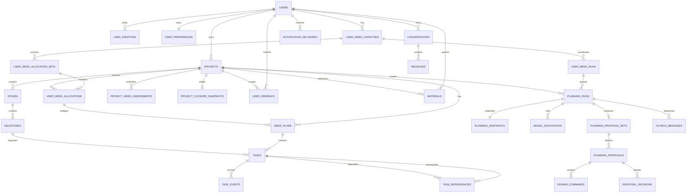

# 数据模型与约束

## 一、建模原则

### 1.1 混合建模

- 用户、项目、路线、周容量、周计划、任务等核心状态使用规范化关系表；
- PlanningSnapshot、模型原始响应、命令参数、证据引用等审计载荷使用 JSONB；
- JSONB 不承担外键关系、容量汇总、当前状态或权限判断；
- 任何改变业务状态的 JSONB 命令都必须先转换为领域命令并通过关系数据校验。

### 1.2 通用字段约定

- 主键：应用生成 UUIDv7，便于分布式创建和大致按时间排序；
- 事件存储序号：`task_events.event_seq` 使用数据库生成的 bigint，只用于主键、分页和近似时间排序，不作为一致性水位；
- 任务事件修订号：每个项目使用 `projects.task_event_revision` 作为提交有序的一致性水位；写 TaskEvent 时先锁定 Project、事务内递增并写入事件；
- 时间戳：使用 `timestamptz` 并按 UTC 存储；
- 业务日期：使用 `date`，自然周固定按 `Asia/Shanghai` 计算；
- 时长：统一使用整数分钟；
- 状态字段：使用 `varchar + check constraint`，避免 PostgreSQL enum 带来的迁移阻力；
- JSONB：必须带 `schema_version`，禁止存放无法识别版本的自由结构；
- 删除：用户、项目和材料使用 `deleted_at`；任务和路线对象优先通过明确状态保留审计记录；
- 所有可并发修改的聚合记录包含 `updated_at` 和对应 revision。

### 1.3 数据隔离

所有用户业务表直接关联 `user_id`。Repository 查询必须显式包含用户范围，不能只按资源 ID 查询。

仅有应用层过滤不足以形成租户边界。所有跨用户业务引用都必须使用包含 `user_id` 的复合外键；项目内引用还应包含 `project_id`。父表为此建立对应复合唯一键。即使应用代码传错 ID，数据库也必须拒绝把用户 A 的 Task、WeekPlan、Milestone、Feedback 或 Material 关联到用户 B 的资源。

当前默认不启用 PostgreSQL RLS；采用应用服务隔离、外键约束、集成测试和审计日志。若开放第三方数据访问，再评估 RLS。

---

## 二、ER 总览



---

## 三、身份与用户

### 3.1 `users`

| 字段 | 类型 | 约束 | 说明 |
|---|---|---|---|
| id | uuid | PK | 内部用户 ID |
| status | varchar(20) | not null, check | `active / suspended / deleting / deleted` |
| display_name | varchar(100) | not null default '' | 展示名称 |
| locale | varchar(20) | not null default `zh-CN` | 当前完整方案固定中文 |
| created_at | timestamptz | not null | 创建时间 |
| updated_at | timestamptz | not null | 更新时间 |
| deleted_at | timestamptz | null | 删除完成时间 |

索引：`(status)`；删除任务按 `(status, updated_at)` 扫描。

### 3.2 `user_identities`

| 字段 | 类型 | 约束 | 说明 |
|---|---|---|---|
| id | uuid | PK | 身份 ID |
| user_id | uuid | FK users, not null | 内部用户 |
| provider | varchar(30) | not null | `wechat / email / apple / phone` |
| provider_subject | varchar(200) | not null | 平台稳定用户标识 |
| metadata | jsonb | not null default `{}` | 非核心平台信息 |
| created_at | timestamptz | not null | 绑定时间 |
| last_login_at | timestamptz | null | 最近登录 |

唯一约束：`unique(provider, provider_subject)`。

### 3.3 `user_preferences`

| 字段 | 类型 | 约束 | 说明 |
|---|---|---|---|
| user_id | uuid | PK, FK users | 用户 |
| weekly_capacity_minutes | integer | check >= 0 | 总周容量基线 |
| utilization_ratio | numeric(4,3) | check 0..1, default 0.85 | 默认安全利用率 |
| preferred_task_minutes | integer | check > 0 | 偏好单次时长 |
| max_task_minutes | integer | check >= preferred | 单任务上限 |
| available_weekdays | smallint | not null | 7 位 bitmask，周一为最低位 |
| stable_preferences | jsonb | schema versioned | 其他稳定偏好 |
| preference_revision | bigint | not null default 1 | 用户长期容量与稳定偏好版本，不包含项目优先级 |
| updated_at | timestamptz | not null | 更新时间 |

`preference_revision` 只在长期偏好或容量基线生效后递增。临时事件写入 UserWeekCapacity 或 UserFeedback，不直接修改基线；项目优先级属于 Project 聚合，由 `project_revision` 保护。

---

## 四、项目与路线

### 4.1 `projects`

| 字段 | 类型 | 约束 | 说明 |
|---|---|---|---|
| id | uuid | PK | 项目 ID |
| user_id | uuid | FK users, not null | 所属用户 |
| name | varchar(120) | not null | 项目名称 |
| description | text | not null | 目标描述 |
| goal_type | varchar(30) | check | `deadline / outcome / capability / continuous` |
| predecessor_project_id | uuid | FK projects, null | 截止后继续时引用前一个已关闭项目 |
| status | varchar(20) | check | `draft / planning / active / paused / completed / closed / archived` |
| target_date | date | null | 截止日期 |
| deadline_day_policy | varchar(20) | check | `event_exclusive / date_inclusive`；考试日不计准备容量，交付日可计 |
| priority | smallint | check 1..100 | 用户确认的优先级 |
| minimum_weekly_minutes | integer | check >= 0 | active 项目的最低维持量；paused 项目不适用 |
| confidence | varchar(10) | check | `low / medium / high` |
| route_revision | bigint | not null default 1 | 路线版本 |
| plan_revision | bigint | not null default 1 | 两周任务窗口版本 |
| project_revision | bigint | not null default 1 | 目标、截止、优先级等项目元数据版本 |
| task_event_revision | bigint | not null default 0 | 项目内任务事件提交有序水位 |
| terminal_reason | varchar(30) | null | `user_completed / deadline_reached` |
| ended_at | timestamptz | null | completed 或 closed 的时间 |
| created_at | timestamptz | not null | 创建时间 |
| updated_at | timestamptz | not null | 更新时间 |
| deleted_at | timestamptz | null | 软删除 |

唯一约束：`unique(id, user_id)`，供所有项目子资源建立租户复合外键。索引：`(user_id, status, priority desc)`、`(user_id, target_date)`。

predecessor_project_id 必须引用同一用户、不得等于自身，且被引用项目必须为 closed；应用服务在锁定前后项目时校验继任链无环。该关系只提供结算上下文，不允许新项目直接继承旧 Task 行或旧状态。

截止只保存 date。Project.target_date 是项目级最终截止；阶段性日期属于 Milestone。考试、证书和比赛使用 `event_exclusive`，target_date 当天不计准备容量；交付使用 `date_inclusive`。用户确认目标实际达成时进入 completed 且 terminal_reason=user_completed；任意设置 target_date 的 planning/active/paused 项目在上海业务日期超过该日期后进入 closed 且 terminal_reason=deadline_reached。到期关闭表示规划生命周期结束，不表示目标实际达成。

截止结算事务将未 advanced 的当前/未来 Stage、Milestone 标记 closed，将仍为 planned 的 Task 标记 cancelled 并写 `reason_code=project_deadline_reached`；completed、skipped、deferred 等历史终态保持不变。事务创建 ProjectClosureSnapshot、递增 route_revision/plan_revision、取消未终结 PlanningRun 并使未应用 Proposal 失效。closed 项目不可恢复为 active；截止后继续必须创建带 predecessor_project_id 的新项目并重新评估旧快照中的未完成内容。draft 项目不会自动关闭，但 target_date 已过时不得进入 planning/active，必须先重新确认目标日期。

状态字段约束：status=completed 时 terminal_reason 必须为 user_completed；status=closed 时必须为 deadline_reached；其他非终态下 terminal_reason 与 ended_at 必须为 null。

### 4.2 `stages`

| 字段 | 类型 | 约束 | 说明 |
|---|---|---|---|
| id | uuid | PK | 阶段 ID |
| user_id | uuid | not null | 所属用户，参与租户复合外键 |
| project_id | uuid | FK projects | 项目 |
| order_key | integer | not null | 当前路线顺序 |
| title | varchar(160) | not null | 名称 |
| objective | text | not null | 阶段目标 |
| strategy | jsonb | versioned | 策略摘要 |
| status | varchar(20) | check | `planned / active / advanced / paused / superseded / closed` |
| estimated_minutes | integer | check >= 0 | 预计投入 |
| target_start_week | date | null | 大致开始周 |
| target_end_week | date | null | 大致结束周 |
| created_route_revision | bigint | not null | 创建时路线版本 |
| updated_route_revision | bigint | not null | 最近修改路线版本 |
| advanced_at | timestamptz | null | 转入后续时间 |
| closed_at | timestamptz | null | 因项目结束冻结时间 |
| closure_reason | varchar(30) | null | `project_completed / project_closed / project_archived` |

约束：`unique(id, user_id, project_id)`；`(project_id, user_id) → projects(id, user_id)`；当前路线内对非 superseded 记录使用部分唯一索引 `(project_id, order_key)`；同一项目最多一个 `active` 阶段。

### 4.3 `milestones`

| 字段 | 类型 | 约束 | 说明 |
|---|---|---|---|
| id | uuid | PK | 里程碑 ID |
| user_id | uuid | not null | 所属用户，参与租户复合外键 |
| project_id | uuid | FK projects | 冗余项目 ID，便于隔离和索引 |
| stage_id | uuid | FK stages | 所属阶段 |
| order_key | integer | not null | 阶段内顺序 |
| title | varchar(160) | not null | 节点名称 |
| objective | text | not null | 推进目标 |
| coverage | jsonb | versioned | 建议覆盖内容 |
| progression_references | jsonb | versioned | 行动、成果和感受参考 |
| estimated_minutes | integer | check >= 0 | 预计投入 |
| target_week_start | date | null | 大致目标周 |
| hard_prerequisites | jsonb | versioned | 客观硬前置条件 |
| status | varchar(20) | check | `planned / active / advanced / paused / superseded / closed` |
| created_route_revision | bigint | not null | 创建版本 |
| updated_route_revision | bigint | not null | 最近修改版本 |
| activated_at | timestamptz | null | 激活时间 |
| advanced_at | timestamptz | null | 转入后续时间 |
| closed_at | timestamptz | null | 因项目结束冻结时间 |
| closure_reason | varchar(30) | null | `project_completed / project_closed / project_archived` |

约束与保护：

- 当前路线内对非 superseded 记录使用部分唯一索引 `(stage_id, order_key)`；
- `unique(id, user_id, project_id)`，并以 `(stage_id, user_id, project_id)` 复合外键保证 Stage 属于同一用户和项目；
- 同一项目最多一个 `active` 里程碑，使用部分唯一索引；
- `advanced` 里程碑的路线定义字段不可修改；
- 数据库触发器拒绝对冻结里程碑修改 title、objective、coverage、progression_references、顺序和目标周；
- 遗留内容通过新 Task 表达，不重新打开冻结里程碑。

### 4.4 `project_closure_snapshots`

截止结算生成一条不可变的一对一快照，不调用 AI 才能完成：

| 字段 | 类型 | 约束 | 说明 |
|---|---|---|---|
| id | uuid | PK | 结算 ID |
| project_id | uuid | FK projects, unique | 被关闭项目 |
| user_id | uuid | FK users | 所属用户 |
| closure_reason | varchar(30) | check | `deadline_reached` |
| target_date | date | not null | 结算时冻结的最终截止日 |
| deadline_day_policy | varchar(20) | not null | 结算时冻结的截止日口径 |
| last_feasibility_status | varchar(20) | check | `feasible / at_risk / infeasible / unknown` |
| last_risk_detected_at | timestamptz | null | 最近一次截止风险预警时间 |
| completed_task_count | integer | check >= 0 | 已完成任务数 |
| unfinished_task_count | integer | check >= 0 | 到期未完成任务数 |
| completed_estimated_minutes | integer | check >= 0 | 已完成任务预计量 |
| completed_actual_minutes | integer | check >= 0 | 明确记录的实际投入 |
| unfinished_estimated_minutes | integer | check >= 0 | 到期未完成预计量 |
| snapshot | jsonb | versioned | 已完成/未完成任务、路线状态、风险证据与版本水位 |
| created_at | timestamptz | not null | 结算时间 |

复合外键 `(project_id, user_id) → projects` 保证租户一致。快照创建后不可更新；继任项目只引用并重新评估，不复制其任务状态。

---

## 五、用户周容量与协调

### 5.1 `user_week_capacities`

| 字段 | 类型 | 约束 | 说明 |
|---|---|---|---|
| id | uuid | PK | 用户周容量 ID |
| user_id | uuid | FK users | 用户 |
| week_start | date | not null | 周一日期 |
| total_minutes | integer | check >= 0 | 本周真实容量 |
| allocatable_minutes | integer | check >= 0 | 乘安全利用率后的可分配容量 |
| buffer_minutes | integer | check >= 0 | 预留缓冲 |
| allocated_minutes | integer | check >= 0 | 当前分配汇总缓存 |
| planned_minutes | integer | check >= 0 | 已生效任务汇总缓存 |
| actual_minutes | integer | check >= 0 | 已记录投入汇总缓存 |
| status | varchar(20) | check | `draft / allocated / active / settled` |
| preference_revision | bigint | not null | 使用的偏好版本 |
| active_allocation_revision | bigint | not null default 0 | 当前生效分配集合版本，0 表示尚未分配 |
| created_at | timestamptz | not null | 创建时间 |
| updated_at | timestamptz | not null | 更新时间 |

唯一约束：`unique(user_id, week_start)`、`unique(id, user_id)`。Check：`allocatable_minutes + buffer_minutes <= total_minutes`。

`allocated_minutes`、`planned_minutes` 是事务内维护的缓存值，应用项目计划时必须锁定本行并校验：

```text
sum(items in active allocation set) <= allocatable_minutes
sum(active week plan minutes) <= allocatable_minutes
```

### 5.2 `user_week_allocation_sets`

每次分配或重新分配都创建不可变的新版本集合，不原地覆盖旧预算。

| 字段 | 类型 | 约束 | 说明 |
|---|---|---|---|
| id | uuid | PK | 分配集合 ID |
| user_id | uuid | not null | 用户 |
| user_week_capacity_id | uuid | not null | 用户周容量 |
| allocation_revision | bigint | not null | 该用户周内递增版本 |
| status | varchar(20) | check | `draft / active / superseded / settled` |
| allocated_minutes | integer | check >= 0 | 本版本预算总和 |
| reason | varchar(40) | not null | `initial / rollover / new_project / capacity_change / recovery` |
| source_user_week_run_id | uuid | null | 生成该版本的协调运行 |
| created_at | timestamptz | not null | 创建时间 |
| activated_at | timestamptz | null | 生效时间 |

约束：`(user_week_capacity_id, user_id) → user_week_capacities(id, user_id)`；`unique(user_week_capacity_id, allocation_revision)`；`unique(id, user_id, user_week_capacity_id)`；部分唯一索引保证一个 UserWeekCapacity 最多一个 `active` 集合。集合进入 active 后，revision、预算总额和 item 预算不可修改；重新分配时在同一事务中创建下一 revision、校验总量、将尚未 settled 的当前 WeekPlan 重新绑定到新集合中同项目 item 并递增 WeekPlan.version、把旧集合标记 superseded，最后切换 `UserWeekCapacity.active_allocation_revision`。新预算不得低于该项目已计划与已投入的锁定量；旧 Snapshot 保留原 allocation 版本用于审计。

### 5.3 `user_week_allocations`

| 字段 | 类型 | 约束 | 说明 |
|---|---|---|---|
| id | uuid | PK | 分配 ID |
| user_id | uuid | not null | 用户 |
| user_week_capacity_id | uuid | not null | 用户周容量，便于复合外键隔离 |
| allocation_set_id | uuid | FK user_week_allocation_sets | 所属不可变版本集合 |
| project_id | uuid | FK projects | 项目 |
| budget_minutes | integer | check >= 0 | 项目预算上限 |
| minimum_minutes | integer | check >= 0 | 最低维持量快照 |
| priority_snapshot | smallint | not null | 优先级快照 |
| project_revision_snapshot | bigint | not null | 生成分配时使用的项目版本 |
| deadline_risk | varchar(10) | check | `none / low / medium / high` |
| allocation_reason | varchar(30) | check | `scheduled / capacity_shortage` |
| status | varchar(20) | check | `reserved / active / unfunded / released / settled` |
| planned_minutes | integer | check >= 0 | 项目已计划汇总 |
| actual_minutes | integer | check >= 0 | 实际投入汇总 |
| created_at | timestamptz | not null | 创建时间 |
| updated_at | timestamptz | not null | 更新时间 |

唯一约束：`unique(allocation_set_id, project_id)`、`unique(id, user_id, project_id)`。复合外键 `(allocation_set_id, user_id, user_week_capacity_id) → user_week_allocation_sets`、`(user_week_capacity_id, user_id) → user_week_capacities`、`(project_id, user_id) → projects` 保证 set、capacity 和 project 均属于同一 user。`budget_minutes`、`minimum_minutes`、`priority_snapshot`、`project_revision_snapshot` 与 `deadline_risk` 在所属集合 active 后不可修改；生命周期状态与投入汇总仍可更新。`budget_minutes=0` 且 `allocation_reason=capacity_shortage` 的项目必须为 `unfunded`，不创建 WeekPlan、不投递 PlanningRun，项目本身仍保持 active。AllocationSet 被 supersede 时，尚未 settled 的 reserved/active/unfunded item 全部转为 released；新 AllocationSet 再按新容量创建 funded 或 unfunded item。

### 5.4 `user_week_runs`

| 字段 | 类型 | 约束 | 说明 |
|---|---|---|---|
| id | uuid | PK | 协调运行 ID |
| user_id | uuid | FK users | 用户 |
| week_start | date | not null | 新执行周 |
| run_type | varchar(20) | check | `rollover / reallocation / recovery` |
| trigger_ref | varchar(200) | null | 新项目、反馈或恢复来源 |
| status | varchar(30) | check | 见状态机文档 |
| expected_projects | integer | check >= 0 | 待处理项目数 |
| succeeded_projects | integer | check >= 0 | 成功数 |
| failed_projects | integer | check >= 0 | 失败数 |
| promotion_completed_at | timestamptz | null | 安全基线晋升完成 |
| allocation_set_id | uuid | null | 使用的明确分配集合版本 |
| idempotency_key | varchar(200) | unique | 运行级幂等键 |
| created_at | timestamptz | not null | 创建时间 |
| updated_at | timestamptz | not null | 更新时间 |

约束：

- 同一用户同一周只有一个 `run_type=rollover`，使用部分唯一索引；
- 周中新增项目或容量变化创建 `reallocation` 运行，可以有多次，但每次使用唯一 trigger_ref/idempotency_key；
- recovery 只恢复指定失败运行，不重新晋升安全基线。

---

## 六、周计划、任务与反馈

### 6.1 `week_plans`

| 字段 | 类型 | 约束 | 说明 |
|---|---|---|---|
| id | uuid | PK | 周计划 ID |
| user_id | uuid | FK users | 用户 |
| project_id | uuid | FK projects | 项目 |
| allocation_id | uuid | FK user_week_allocations | 项目周预算 |
| week_start | date | not null | 周一日期 |
| status | varchar(20) | check | `prepared / active / settled / superseded` |
| generation | integer | not null default 1 | 同项目同周的历史代次 |
| version | bigint | not null default 1 | WeekPlan 行级乐观锁版本 |
| project_plan_revision | bigint | not null | 创建或最近更新时的 Project.plan_revision |
| budget_minutes | integer | check >= 0 | 预算快照 |
| planned_minutes | integer | check >= 0 | 任务时长汇总 |
| summary | text | not null default '' | 周目标摘要 |
| creation_source | varchar(30) | check | `initial_planning / allocation_shell / weekly_review / temporary_replan / recovery / calibration_hold` |
| source_planning_run_id | uuid | FK planning_runs, null | 生成来源 |
| promoted_at | timestamptz | null | 晋升为安全基线时间 |
| settled_at | timestamptz | null | 结算时间 |
| created_at | timestamptz | not null | 创建时间 |
| updated_at | timestamptz | not null | 更新时间 |

唯一约束：`unique(project_id, week_start, generation)`；部分唯一索引保证同一项目同一周最多一个 `prepared/active` 当前计划。Check：`planned_minutes <= budget_minutes`。

租户与预算归属通过复合外键强制：`(project_id, user_id) → projects`，`(allocation_id, user_id, project_id) → user_week_allocations`；同时建立 `unique(id, user_id, project_id)` 供 Task 引用。

`Project.plan_revision` 是执行周与预备周整个窗口的聚合版本；WeekPlan.version 只保护单行并发；generation 用于保留同一周被 superseded 的历史计划。三个概念不得混用。

`week_start` 必须是上海时区自然周的周一。普通 Task 只归属 WeekPlan，不指定执行日；可选 due_date 必须落在目标周内。Project.target_date 只有落在该 WeekPlan 周内时才向任务继承边界，更远截止保持 null，由领域服务校验。

下一预备周预算分配提交时，确定性协调服务只为满足 `Project.status=active && budget_minutes>0 && 非 deadline-week && 非 calibration_hold` 的项目创建或复用 `creation_source=allocation_shell` 的空 `prepared` WeekPlan，并绑定该次 allocation item。unfunded、截止周、paused 或 needs_calibration 项目不获得下一周任务壳计划，也不投递 PlanningRun。项目 PlanningSnapshot 只能在该事务提交后创建，因此符合准入条件的项目 `week.prepared` 始终可解析；WeeklyReview 只向该壳计划填充或调整 Task，不负责创建 WeekPlan。首次规划的残周少于 4 天是唯一前瞻例外：在本周启动计划之外，可同时创建下一完整执行周与后一预备周的两个已绑定 allocation item 的计划；下周周一仍按普通晋升规则将前者变为 active。若连续无记录且没有 prepared，周一只创建 `creation_source=calibration_hold` 的空 active WeekPlan，不创建更远周计划。

### 6.2 `tasks`

| 字段 | 类型 | 约束 | 说明 |
|---|---|---|---|
| id | uuid | PK | 任务 ID |
| user_id | uuid | FK users | 用户 |
| project_id | uuid | FK projects | 项目 |
| week_plan_id | uuid | FK week_plans | 周计划 |
| source_milestone_id | uuid | FK milestones | 来源节点，可指向冻结节点 |
| origin_task_id | uuid | FK tasks, null | 拆分、替换或复习来源 |
| title | varchar(200) | not null | 任务名称 |
| description | text | not null default '' | 执行说明 |
| task_kind | varchar(20) | check | `main / review / remediation / exploration / rest` |
| estimated_minutes | integer | check > 0 | 预计时长 |
| actual_minutes | integer | null, check >= 0 | 用户记录的累计实际时长当前投影；后续修改覆盖，不按事件重复累加 |
| first_completed_at | timestamptz | null | 第一次完成时间；用于无实际时长时判断是否发生过真实完成 |
| necessity | varchar(10) | check | `required / optional` |
| due_date | date | null | 客观最晚完成日期，不代表指定执行日；通常由后端继承 |
| order_key | integer | not null | 周任务推荐顺序，由模型数组顺序生成 |
| status | varchar(20) | check | `planned / completed / skipped / deferred / cancelled / replaced` |
| version | bigint | not null default 1 | 命令前置条件 |
| source_command_id | uuid | FK domain_commands, null | AI 命令来源 |
| created_at | timestamptz | not null | 创建时间 |
| updated_at | timestamptz | not null | 更新时间 |

索引：

- `(user_id, week_plan_id, status, order_key)`；
- `(user_id, due_date, status)`；
- `(project_id, week_plan_id, status)`；
- `(source_milestone_id, status)`。

唯一约束：`unique(week_plan_id, order_key)`。order_key 由后端按模型数组顺序生成并使用稀疏步长，后续重排不要求模型输出数据库顺序值。

复合外键：`(week_plan_id, user_id, project_id) → week_plans`、`(source_milestone_id, user_id, project_id) → milestones`；`origin_task_id` 若非空也必须与当前任务属于同一 user/project。数据库不能只凭单列 ID 建立这些关系。

Task 不保存 `is_blocking/is_blocked`，也不保存 difficulty。阻塞由 TaskDependency 动态计算；执行感受通过反馈记录。actual_minutes 是累计总量投影，不是单次 session；完成事件携带时长与单独的 duration_recorded 使用同一幂等更新语义，不能重复计入。用户不能经公开 API 直接 INSERT Task，所有任务来自经过校验的系统/AI 规划命令。

### 6.3 `task_dependencies`

| 字段 | 类型 | 约束 | 说明 |
|---|---|---|---|
| id | uuid | PK | 依赖 ID |
| user_id | uuid | not null | 用户 |
| project_id | uuid | not null | 项目 |
| prerequisite_task_id | uuid | not null | 必须先满足的任务 |
| dependent_task_id | uuid | not null | 被依赖任务 |
| created_at | timestamptz | not null | 创建时间 |

唯一约束：`unique(prerequisite_task_id, dependent_task_id)`。两个 Task 均使用 `(id, user_id, project_id)` 复合外键，禁止跨租户/项目依赖。后端在同一 Proposal 批次内验证依赖图无环；只有客观不可反转的关系才写依赖，普通推荐顺序只使用 order_key。

```text
is_blocking(task) = exists outgoing dependency
is_blocked(task) = exists incoming dependency whose prerequisite is not completed
```

这两个值是查询派生结果，不是 AI 输出或可信存储字段。

### 6.4 `task_events`

| 字段 | 类型 | 约束 | 说明 |
|---|---|---|---|
| event_seq | bigint identity | PK | 存储与分页序号；不作为一致性水位 |
| id | uuid | unique | 对外事件 ID |
| task_id | uuid | FK tasks | 任务 |
| user_id | uuid | FK users | 用户 |
| project_id | uuid | FK projects | 项目 |
| project_event_revision | bigint | not null | 项目内按事务提交顺序递增的事件修订号 |
| event_type | varchar(20) | check | `completed / reopened / skipped / restored / deferred / cancelled / replaced / duration_recorded` |
| previous_status | varchar(20) | not null | 旧状态 |
| new_status | varchar(20) | not null | 新状态 |
| actual_minutes | integer | null, check >= 0 | 本次写入的累计实际时长；应用后覆盖 Task.actual_minutes |
| reason_code | varchar(40) | null | 机器可读原因；截止终止使用 `project_deadline_reached` |
| note | text | null | 用户备注 |
| idempotency_key | varchar(200) | not null | 客户端写入幂等键 |
| occurred_at | timestamptz | not null | 事件发生时间 |
| created_at | timestamptz | not null | 服务接收时间 |

唯一约束：`unique(user_id, idempotency_key)`、`unique(project_id, project_event_revision)`。索引：`(project_id, project_event_revision)`、`(task_id, event_seq)`。复合外键 `(task_id, user_id, project_id) → tasks` 强制事件与任务租户一致。

写事件时按统一锁顺序锁定 Project 后锁定 Task，将 `Project.task_event_revision + 1` 同时写回 Project 和新 TaskEvent。这样 revision 的可见顺序与事务提交顺序一致；`event_seq` 即使因并发或回滚出现跳号也不会漏事件。

任务表保存当前状态，TaskEvent 保存不可变历史。actual_minutes 采用“累计总量、后写覆盖”语义；重复提交由 idempotency_key 去重，修正只追加新事件，不重放历史事件求和。撤销完成使用 `reopened`，恢复 skipped 使用 `restored`，都追加新事件而不删除历史。周结算决定延期时写 deferred 事件，旧任务进入终态，并在新周创建只表示剩余工作的 origin_task_id 新任务；旧任务已记录的实际投入归属于旧周，不跨周移动旧行。项目截止结算对每个 planned Task 写 cancelled 事件及 `reason_code=project_deadline_reached`，不能与用户主动取消混淆。

### 6.5 `user_feedback`

| 字段 | 类型 | 约束 | 说明 |
|---|---|---|---|
| id | uuid | PK | 反馈 ID |
| user_id | uuid | FK users | 用户 |
| project_id | uuid | FK projects, null | 影响项目，空表示用户级 |
| source | varchar(20) | check | `chat / form / task / system_question` |
| raw_text | text | not null | 原始反馈 |
| candidate_scope | varchar(30) | null | 模型候选分类 |
| confirmed_scope | varchar(30) | null | `one_time / stable_preference / goal_change` |
| impact_scope | varchar(20) | null | `task / project / user / goal`，决定路由范围 |
| impact_nature | varchar(20) | null | `temporary / observe / structural / goal_change` |
| urgency | varchar(20) | null | `immediate / weekly / trend` |
| execution_blocked | boolean | null | 明确反馈是否阻塞当前执行 |
| signal_kind | varchar(30) | null | `execution_fact / difficulty / availability / preference / goal_change / other` |
| status | varchar(30) | check | `received / classified / pending_confirmation / applied / dismissed` |
| structured_payload | jsonb | versioned | 解析后的候选信息 |
| created_at | timestamptz | not null | 创建时间 |
| applied_at | timestamptz | null | 生效时间 |

目标、截止、长期容量和多项目优先级变化必须进入 `pending_confirmation`，不能因模型分类直接生效。

若 `project_id` 非空，使用 `(project_id, user_id) → projects` 复合外键，禁止跨租户反馈关联。

### 6.6 `project_week_assessments`

每个项目每周最多一条结构化评估，作为最近 2—3 周趋势的确定性输入，不让模型每次从原始任务重新总结同一历史。`not_scheduled` 表示本周预算为 0，不是用户无记录，不进入 needs_calibration 趋势。

| 字段 | 类型 | 约束 | 说明 |
|---|---|---|---|
| id | uuid | PK | 周评估 ID |
| user_id | uuid | not null | 用户 |
| project_id | uuid | not null | 项目 |
| week_start | date | not null | 被评估自然周 |
| status | varchar(20) | check | `normal / ahead / behind / overloaded / blocked / needs_calibration / not_scheduled / insufficient_data` |
| impact_nature | varchar(20) | check | `temporary / observe / structural / none` |
| planned_minutes | integer | check >= 0 | 计划量快照 |
| completed_minutes | integer | check >= 0 | 按已完成任务预计时长汇总 |
| recorded_actual_minutes | integer | check >= 0 | 用户明确记录的实际时长汇总 |
| primary_reason | varchar(40) | null | 主要原因分类 |
| deadline_risk | varchar(10) | check | `none / low / medium / high` |
| evidence_refs | jsonb | versioned | 任务事件、反馈和路线证据 |
| assessment_revision | bigint | not null default 1 | 评估修订号 |
| created_at, updated_at | timestamptz | not null | 审计时间 |

唯一约束：`unique(project_id, week_start)`；复合外键 `(project_id, user_id) → projects`。连续 2 周同类异常触发结构性原因检查，连续 3 周仍未恢复形成强信号；中间 normal 则连续计数重置。明确硬阻塞、稳定限制变化或截止风险可绕过趋势窗口。

---

## 七、对话与材料

### 7.1 `conversations` 与 `messages`

`conversations`：`id, user_id, project_id, status, created_at, updated_at`；项目非空时使用 `(project_id, user_id) → projects` 复合外键。

`messages`：`id, conversation_id, role, content, content_redacted, structured_refs(jsonb), created_at`。

对话用于交互和解释，不作为规划真相。上下文构建器只选择相关消息摘要，不把全部消息自动发送给模型。

### 7.2 `materials`

核心字段：

- `id, user_id, project_id`；
- `object_key, original_filename, mime_type, byte_size, checksum_sha256`；
- `scan_status`: `pending / clean / rejected / failed`；
- `parse_status`: `pending / processing / parsed / failed`；
- `summary` JSONB 与 `summary_schema_version`；
- `extracted_text_object_key`；
- `retention_until, deleted_at, created_at, updated_at`。

索引：`(user_id, project_id, deleted_at)`、`(scan_status, created_at)`、`(parse_status, updated_at)`。

若 `project_id` 非空，使用 `(project_id, user_id) → projects` 复合外键，禁止跨租户材料关联。

---

## 八、AI、命令与可靠投递

### 8.1 `planning_runs`

| 字段 | 类型 | 说明 |
|---|---|---|
| id | uuid PK | 运行 ID |
| user_id | uuid FK | 用户 |
| project_id | uuid FK null | 项目级运行 |
| user_week_run_id | uuid FK null | 周协调父运行 |
| workflow_type | varchar(40) | 工作流类型 |
| status | varchar(30) | 见状态机文档 |
| idempotency_key | varchar(200) unique | 业务运行幂等键 |
| input_versions | jsonb | 依赖版本向量 |
| attempt_count | integer | 业务执行次数 |
| priority | smallint | 队列优先级 |
| lease_owner | varchar(120) null | 当前 Worker 所有者 |
| lease_expires_at | timestamptz null | 执行租约到期时间 |
| heartbeat_at | timestamptz null | 最近续租心跳 |
| next_retry_at | timestamptz null | 下次允许领取时间 |
| queued_at, started_at, finished_at | timestamptz | 生命周期时间 |
| error_code, error_message | text | 标准化错误 |
| created_at, updated_at | timestamptz | 审计时间 |

### 8.2 `planning_snapshots`

`id, planning_run_id(unique), schema_version, payload(jsonb), task_event_revision, content_hash, created_at`。

`task_event_revision` 来自该项目在快照事务中读取的 `Project.task_event_revision`；用户级工作流使用 `{project_id: revision}` 映射。Snapshot 创建后不可修改。`content_hash` 用于检测意外变化和调试复现。

### 8.3 `model_invocations`

保存一次模型调用：`planning_run_id, attempt_no, provider, model, prompt_version, request_redacted, response_payload, input_tokens, output_tokens, estimated_cost, latency_ms, status, error_code, created_at`。

原始敏感文本不默认进入日志；`request_redacted` 仅保留经过脱敏且对调试必要的内容。

### 8.4 `planning_proposal_sets`

一次 PlanningRun 最多产生一个 ProposalSet，用于保存同一模型响应及其拆批关系：

- `id, planning_run_id(unique), status`；
- `summary, evidence_summary, confidence`；
- `input_versions` JSONB；
- `created_at, completed_at`。

Set 的 status 是派生汇总，例如 `processing / pending_confirmation / completed / invalidated`，不能替代各原子 Proposal 的事务状态。

### 8.5 `planning_proposals`

核心字段：

- `id, proposal_set_id, batch_no, status`；
- `batch_kind`：`auto / confirm / discuss`；
- `input_versions` JSONB；
- `required_permission`：该批次后端计算的权限；
- `created_at, expires_at, applied_at`。

唯一约束：`unique(proposal_set_id, batch_no)`。每个 Proposal 都是原子批次；不得把自动命令和待确认命令放在同一 Proposal 中。自动批次应用后，待确认批次使用新的版本向量持久化。

### 8.6 `domain_commands`

核心字段：

- `id, proposal_id, command_id, command_type`；
- `target_ref`；
- `expected_state, payload, evidence_refs, input_versions` JSONB；
- `suggested_permission` 与 `computed_permission`；
- `idempotency_key`：后端根据 run、command_id 和规范化 payload 计算；
- `status, error_code, created_at, applied_at`。

唯一约束：`unique(proposal_id, command_id)`、`unique(idempotency_key)`。

模型只生成 `command_id`，不生成可信 idempotency_key。后端完成引用映射、payload 规范化后计算幂等键。

### 8.7 `proposal_decisions`

`id, proposal_id, decision, decided_by, actor_user_id, reason, idempotency_key, created_at`。

唯一约束：`unique(proposal_id, idempotency_key)`。

### 8.8 `api_idempotency_records`

| 字段 | 类型 | 说明 |
|---|---|---|
| id | uuid PK | 记录 ID |
| user_id | uuid FK | 用户范围 |
| idempotency_key | varchar(200) | 客户端请求键 |
| request_method | varchar(10) | HTTP 方法 |
| request_path | varchar(500) | 规范化路由与资源范围 |
| request_hash | char(64) | 规范化请求体 SHA-256 |
| response_status | integer | 首次完成响应状态码 |
| response_body | jsonb | 首次完成响应 |
| resource_type, resource_id | varchar / uuid null | 可选结果资源引用 |
| status | varchar(20) | `processing / completed / failed` |
| locked_until | timestamptz null | 首次请求处理租约 |
| expires_at | timestamptz | 保留截止时间 |
| created_at, completed_at | timestamptz | 生命周期时间 |

唯一约束：`unique(user_id, idempotency_key)`。同 key 的 method/path/hash 任一不同返回 `IDEMPOTENCY_KEY_REUSED`；相同且 completed 返回首次响应；processing 租约未过期返回可重试冲突或原运行资源。记录清理不得早于客户端约定的最大重试窗口。

### 8.9 `outbox_messages`

| 字段 | 类型 | 说明 |
|---|---|---|
| id | uuid PK | 消息 ID |
| planning_run_id | uuid FK null | 关联运行 |
| message_key | varchar(200) unique | 业务消息幂等键 |
| topic | varchar(80) | 消息类型 |
| target_queue | varchar(50) | Celery 队列 |
| payload | jsonb | 只包含 ID 和必要路由信息 |
| status | varchar(20) | `pending / claimed / published / dead` |
| claimed_by | varchar(100) null | Dispatcher 实例 |
| claimed_at, claim_expires_at | timestamptz null | claim 租约 |
| attempt_count | integer | 投递次数 |
| next_retry_at | timestamptz | 下次投递 |
| last_error | text null | 最近错误 |
| created_at, published_at | timestamptz | 生命周期时间 |

索引：

- Dispatcher 扫描：`(status, next_retry_at, created_at)`；
- claim 恢复：`(status, claim_expires_at)`；
- 运行查询：`(planning_run_id)`。

---

## 九、通知

`notification_deliveries` 核心字段：`id, user_id, channel, template_key, payload, status, idempotency_key, attempt_count, next_retry_at, provider_message_id, sent_at, last_error, created_at`。

唯一约束：`unique(idempotency_key)`。通知与规划使用独立队列，失败不影响周滚动。

---

## 十、关键数据库约束与锁顺序

### 10.1 必需唯一约束

- `user_week_capacities(user_id, week_start)`；
- `user_week_allocation_sets(user_week_capacity_id, allocation_revision)`，并保证每个容量最多一个 active set；
- `user_week_allocations(allocation_set_id, project_id)`；
- `user_week_runs(user_id, week_start)` 仅对 rollover 使用部分唯一索引；
- `week_plans(project_id, week_start, generation)`，并对 prepared/active 使用部分唯一索引；
- 同一项目一个 active milestone；
- 同一项目一个 active stage；
- `planning_proposal_sets(planning_run_id)` 与 `planning_proposals(proposal_set_id, batch_no)`；
- `task_events(project_id, project_event_revision)`；
- `task_dependencies(prerequisite_task_id, dependent_task_id)`；
- `project_week_assessments(project_id, week_start)`；
- PlanningRun、Outbox、DomainCommand、TaskEvent 和 ApiIdempotencyRecord 的业务幂等键。
- `project_closure_snapshots(project_id)`，保证截止结算重复扫描只产生一条不可变快照；

### 10.2 锁顺序

涉及容量和项目计划的事务固定按以下顺序加锁，避免死锁：

```text
user_week_capacity（跨周时按 week_start 排序）
→ user_week_allocation_set
→ user_week_allocations（按 project_id 排序）
→ projects（按 project_id 排序）
→ week_plans
→ tasks / milestones
```

项目 Worker 不能先锁 Project 再回头锁 UserWeekCapacity。

不涉及容量的 TaskEvent 事务使用 `project → task`；先锁 Project 并分配 `project_event_revision`，再锁 Task。任何同时涉及容量与任务的事务仍遵守完整顺序，不能从 Task 回头锁 Project。

### 10.3 容量一致性

跨表总量约束无法仅靠普通 CHECK 完成。领域服务在持有 UserWeekCapacity 行锁时：

1. 汇总 active AllocationSet 的 items；
2. 验证不超过 allocatable_minutes；
3. 汇总相关 WeekPlan planned_minutes；
4. 验证项目预算和用户总预算；
5. 更新缓存汇总字段；
6. 提交事务。

项目暂停引起周中重分配时，旧 allocation item 和其计划只保留审计汇总；可重新分配的容量等于原可分配容量减去已发生的实际投入及其他不可撤销的已完成工作量。暂停项目的当前 active 与后续 reserved item 都转为 `released`，不会作为新集合的可用预算或重新绑定目标。

定时一致性检查任务每天重新汇总并上报差异，但不自动覆盖数据。

### 10.4 截止前可行性

规划仍以周为单位，不建立每日任务表。后端使用 available_weekdays 和周可分配容量等额折算：

```text
day_discount_capacity(cutoff) = floor(
  allocatable_minutes × count(available days from planning_start through cutoff)
  / count(available_weekdays in full week)
)
effective_consumed(task) =
  task.actual_minutes                         if actual_minutes is not null
  else task.estimated_minutes                  if task.first_completed_at is not null
  else 0
consumed_minutes = sum(effective_consumed(task) for tasks in this week)
capacity_before(cutoff) = min(
  day_discount_capacity(cutoff),
  allocatable_minutes - consumed_minutes
)
```

执行周 planning_start 为当前上海业务日期，预备周为 week_start；已过去日期不再计容量。考试类 `event_exclusive` 不计 target_date，当日考试任务的 effective_due_date 取前一日；交付类 `date_inclusive` 可计 target_date。对周内每个不同 cutoff，校验所有项目 `necessity=required AND effective_due_date <= cutoff` 的 planned Task estimated_minutes 累计值不超过 capacity_before(cutoff)。无 due_date 的普通任务只参与周总量校验。多个项目共享同一累计容量，不得分别重复使用。部分投入后 deferred 的旧任务实际时长只计入旧周，新任务只校验剩余预计分钟。

available_weekdays_count=0 时截止前容量和周可执行容量均视为 0，不执行除法；只有显式 rest/说明性条目可以存在。

校验在 Proposal 预检和事务应用时各执行一次。失败返回 `DEADLINE_CAPACITY_EXCEEDED`，包含 cutoff、available_minutes、required_minutes 和 overflow_minutes；模型最多修正一次，仍不可行则输出风险与用户选择。

### 10.5 冻结数据保护

- advanced/closed milestone 使用数据库触发器保护路线定义字段；
- settled WeekPlan 不允许新增或移动任务；
- completed Task 可以通过 `reopened` 事件显式撤销，但不能静默覆盖；
- Task.actual_minutes 只能由带幂等键的完成或 duration_recorded 事件覆盖，不能通过普通 Task PATCH 直接修改；
- Snapshot、TaskEvent、ModelInvocation 和 ProposalDecision 只追加，不更新业务内容。

### 10.6 租户复合外键

至少建立以下父级复合唯一键：`projects(id, user_id)`、`stages(id, user_id, project_id)`、`milestones(id, user_id, project_id)`、`user_week_capacities(id, user_id)`、`user_week_allocation_sets(id, user_id, user_week_capacity_id)`、`user_week_allocations(id, user_id, project_id)`、`week_plans(id, user_id, project_id)`、`tasks(id, user_id, project_id)`。

所有带冗余 `user_id/project_id` 的子表必须以这些组合建立复合外键，而不是并列的单列外键。Alembic 集成测试必须直接执行跨用户、跨项目错误 INSERT，并断言数据库拒绝；只测试 Repository 过滤不算通过。

---

## 十一、迁移与保留策略

- Alembic 迁移必须可向前执行，生产环境不依赖 `create_all`；
- 大字段新增先允许 null，回填后再加 not null；
- 删除列分“停止写入 → 数据迁移 → 观察 → 删除”多个版本；
- PlanningSnapshot 与模型响应按产品保留策略归档或删除；
- 用户删除任务异步清理材料、消息、模型调试载荷和对象存储，并保留最小删除审计记录；
- 业务事件若因合规需要删除，应使用去标识化而不是保留原始个人内容。
