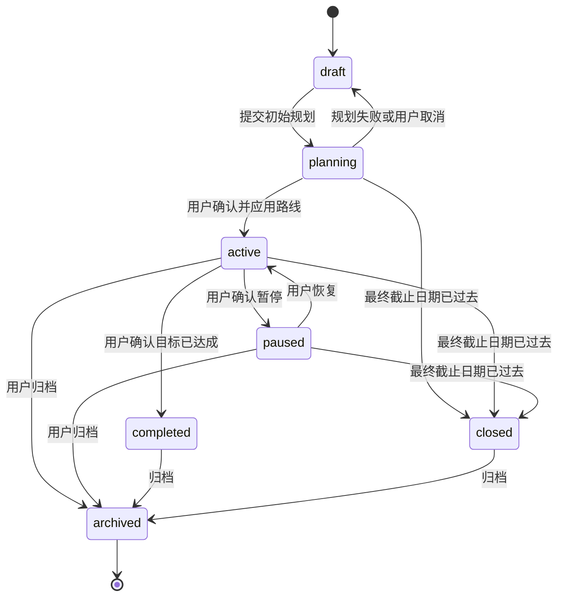
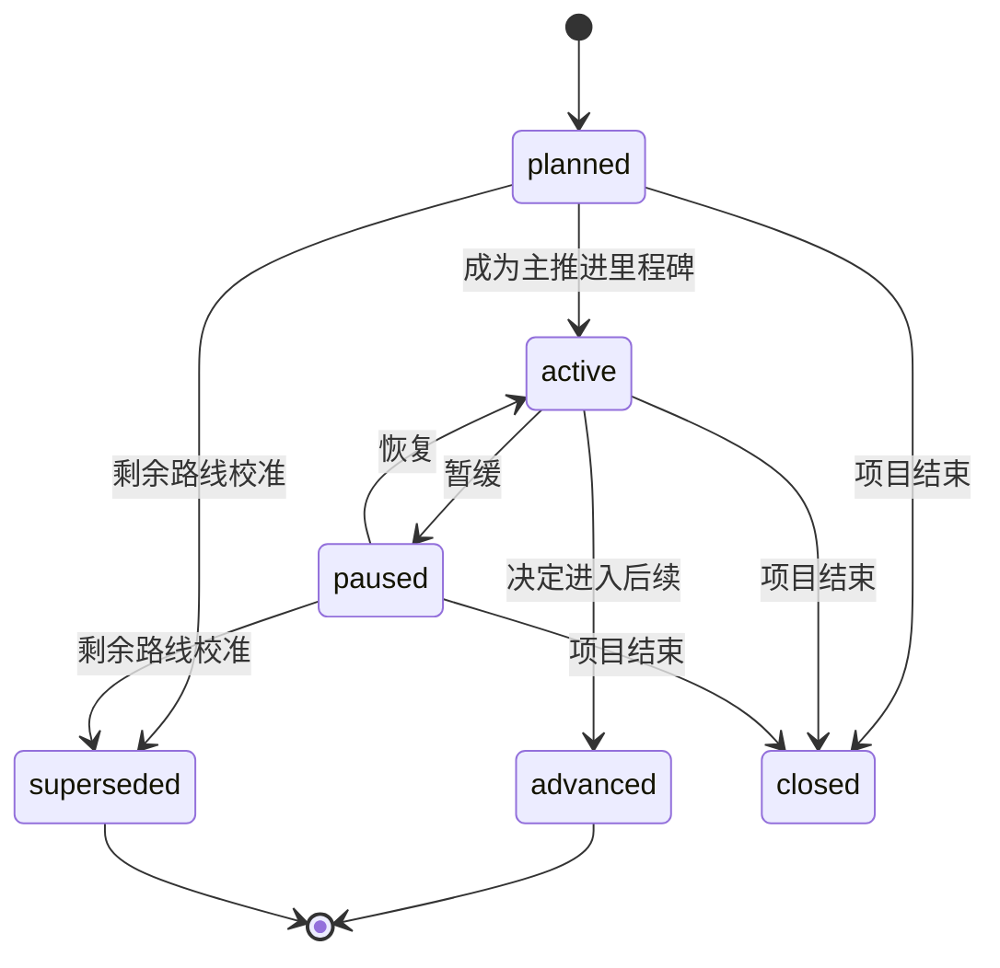
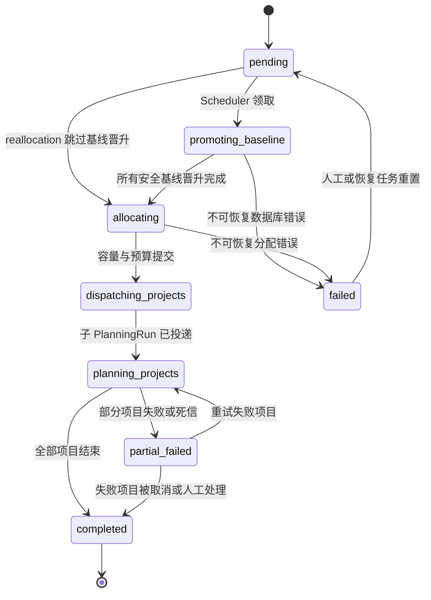
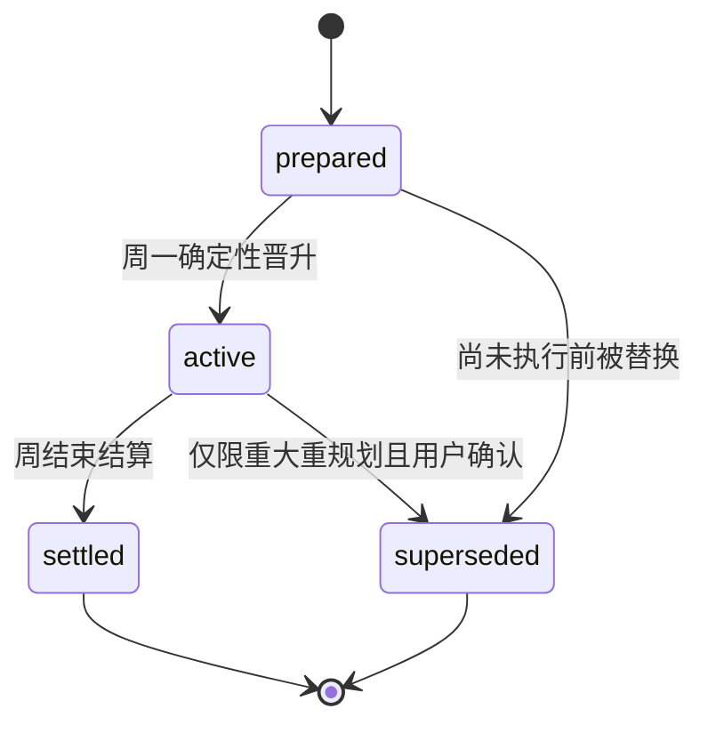
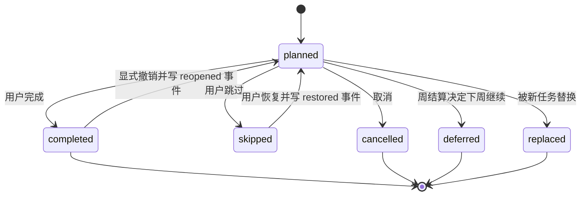
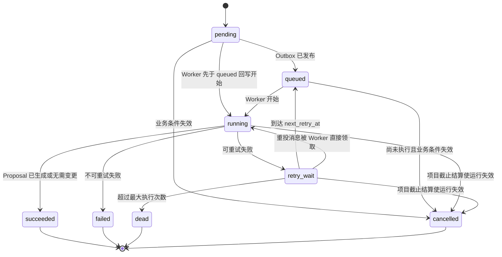
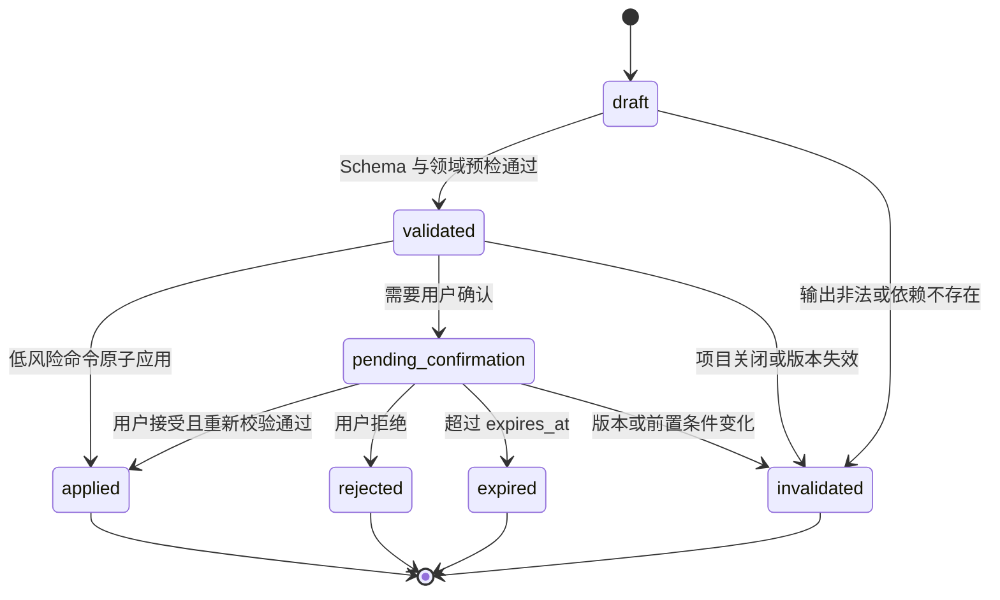
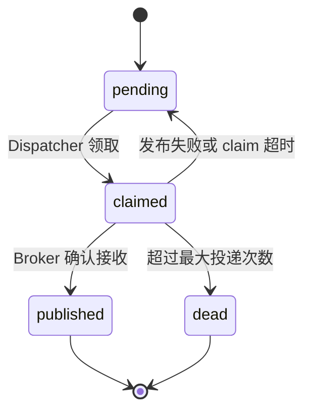

# 领域状态机

## 一、通用规则

- 状态变更只能通过应用服务或领域命令处理器完成；
- 每次变更记录操作者、原因、关联 PlanningRun/Proposal 和 correlation_id；
- 非法状态迁移返回 `STATE_TRANSITION_NOT_ALLOWED`；
- 重试同一幂等操作返回首次成功结果，不重复执行副作用；
- 所有“当前时间”由可注入 Clock 提供，生产实现固定读取 `Asia/Shanghai` 业务日期；
- 后台任务崩溃后从数据库状态恢复，不能依赖 Worker 内存判断进度。

---

## 二、项目与路线状态

### 2.1 Project



约束：

- `planning` 阶段可以保存 Proposal，但不能向首页暴露未生效任务；
- `paused` 项目不获得普通周预算，除非用户明确配置最低维持任务；
- `completed` 表示用户确认目标实际达成，terminal_reason=user_completed；系统仍不承担考试通过或能力认证；
- 任意设置 target_date 的 planning/active/paused 项目在业务日期超过该日期后自动 closed，terminal_reason=deadline_reached；这表示规划生命周期结束，不表示目标实际达成；
- `closed` 不可恢复为 active；截止后继续必须创建引用 ProjectClosureSnapshot 的继任项目；
- draft 的 target_date 已过时不得进入 planning/active，必须先重新确认日期；
- `archived` 只读，不参与周滚动。

项目最终截止结算使用一个领域事务：当上海业务日期超过 target_date，按统一锁顺序锁定 Project，确认 deadline_day_policy，将 planning/active/paused Project 转为 closed、terminal_reason=`deadline_reached`、ended_at=now；将所有未 advanced 的 Stage/Milestone 转为 closed；将所有仍为 planned 的 Task 转为 cancelled 并写 `reason_code=project_deadline_reached`；创建不可变 ProjectClosureSnapshot；递增 route_revision/plan_revision；取消项目内 pending/queued/running/retry_wait PlanningRun；使 draft/validated/pending_confirmation Proposal 失效；停止创建下一预备周。任一步失败则整批回滚。advanced 与任务历史终态保持原状。event_exclusive 与 date_inclusive 只影响 target_date 当天是否仍可执行，不改变到期后的关闭规则。

到期前，每次任务终态变化、反馈、容量变化、周滚动或规划命令应用后都重新校验截止可行性；每日扫描兜底。infeasible 结果立即产生 deadline_risk 并触发 EventDrivenReplanning，不进入 2—3 周观察等待。截止结算优先于普通周滚动和路线校准；结算锁定后，旧 Worker 即使完成模型调用也不能提交结果。

### 2.2 Stage

```text
planned → active → advanced
    └────────────→ superseded
active ↔ paused
paused → superseded
planned / active / paused → closed: 项目结束
```

- 同一项目最多一个 active Stage；
- `advanced` 为冻结状态；
- `closed` 表示项目已结束但阶段未被证明完成，同样冻结；
- 未来路线重塑使用 superseded + 新建对象，不复用旧对象表达不同含义。

### 2.3 Milestone



关键不变量：

- 同一项目最多一个 active Milestone；
- `advanced` 只代表规划流程已前进；
- `advanced` 后路线定义字段冻结；
- `closed` 后路线定义字段冻结，且不能解释为 advanced；
- 遗留内容转成 Task，不通过 `advanced → active` 重新打开；
- 后续明确阻塞优先创建 remediation Task；只有路线结构改变时才校准未来 Milestone。

跨 Stage 推进是一个不可拆分的领域事务。当前 Milestone 是当前 Stage 最后一个未 superseded 节点时，`AdvanceMilestone` 必须在同一事务内完成：当前 Milestone `active → advanced`、当前 Stage `active → advanced`、下一 Stage `planned → active`、下一 Stage 首个可用 Milestone `planned → active`，最后只递增一次 `Project.route_revision`。任一步前置条件不满足则全部回滚。若同 Stage 仍有下一 Milestone，只推进当前/下一 Milestone，Stage 保持 active。

---

## 三、用户周协调状态

### 3.1 UserWeekRun



恢复规则：

- `promoting_baseline` 可幂等重入；已经 active 的 WeekPlan 跳过；
- rollover 运行必须经过 promoting_baseline；周中新增项目的 reallocation 从 pending 直接进入 allocating；
- 只有安全基线全部晋升后才进入 allocating；
- 项目子任务失败不回滚已完成的基线晋升和预算分配；
- `partial_failed` 用户仍可执行当前周，后台继续生成缺失的预备周；
- `completed` 要求所有 active 项目均有明确子运行结果：成功、无需计划或人工取消。

### 3.2 UserWeekCapacity

```text
draft → allocated → active → settled
```

- draft：根据偏好和临时事件计算容量；
- allocated：项目预算已确定；
- active：该周正在执行，可减少未锁定预算，增加预算需检查余量；
- settled：自然周结束，只允许写实际投入汇总和审计修正。

### 3.3 UserWeekAllocationSet 与 Item

AllocationSet：

```text
draft → active → settled
            └→ superseded
```

- 每次重新分配创建 revision 更大的 draft set；
- 领域服务在同一事务校验总量，把未 settled 的当前 WeekPlan 重新绑定到新 item 并递增其 version，激活新 set、supersede 旧 set，并切换 Capacity 当前 revision；
- active 后预算 item 不可原地改写；失败事务不留下半切换版本；
- 新 item 的预算不得低于该项目已计划和已投入的锁定量；settled WeekPlan 永不重新绑定；
- set 被 supersede 时，其未 settled item 转为 released；新 item 根据所绑定 WeekPlan 是 prepared/active 进入 reserved/active；
- WeekPlan 永远引用明确 allocation item，而不是“当前预算”的浮动指针。

Allocation item：

```text
reserved → active → settled
    └────→ released
```

- reserved：为预备周预留预算；
- active：对应 WeekPlan 已晋升或生效；
- released：项目暂停、删除或预算重新分配；
- settled：该周结束。

预算重新分配必须生成新的 AllocationSet revision。已经完成的任务和实际投入不被回收；新版本只能重新分配未锁定余量。

---

## 四、WeekPlan 状态与周一语义



### 4.1 周一安全基线事务

对一个 UserWeekRun：

1. 锁定目标周 UserWeekCapacity；
2. 按 project_id 顺序锁定 allocations；
3. 找到各项目该周 prepared WeekPlan；
4. 将 prepared 原子更新为 active，并写入 promoted_at；
5. allocation 从 reserved 更新为 active；
6. 对没有 prepared 计划的 active 项目创建空安全基线并记录异常；
7. 提交后再投递 AI 周评估。

创建空安全基线只防止状态缺口，不生成假任务。该项目显示“本周计划正在补充”，并优先进入 planning_weekly 队列。

active WeekPlan 被 superseded 时，替代 active WeekPlan 必须在同一事务创建；同一项目同一周不能出现没有当前计划或两个当前计划的中间提交状态。

### 4.2 AI 增量修正

- 不修改已完成任务；
- 低风险命令可修改尚未开始的 active WeekPlan 任务；
- 需要确认的命令不阻塞原任务；
- 用户未确认时原 active 计划持续有效；
- 新 prepared WeekPlan 可以晚于周一生成，但 active WeekPlan 始终存在。
- 分配事务只为下一周仍可执行的项目确定性创建空 prepared 壳计划，再投递项目 PlanningRun；WeeklyReview 只能填充这个已存在的计划，Snapshot 构建前必须能解析 `week.prepared`。若任意 Project.target_date 落在当前周，项目进入 terminal deadline-week 分支，`week.prepared` 合法缺省且不得创建截止后的任务。

---

## 五、Task 状态



规则：

- 每次迁移必须同时追加 TaskEvent；
- Task 当前状态和 TaskEvent 在同一事务提交；
- `completed → planned` 与 `skipped → planned` 都会提高项目 `task_event_revision`，使依赖执行事实的旧命令重新校验；
- cancelled/replaced 不允许恢复，若需恢复则创建新 Task 并保留 origin_task_id；
- deferred 是旧周任务终态，不等同 skipped；领域事务必须在目标周创建带 origin_task_id 的新 Task，旧行不得跨周移动；
- Task 不保存 is_blocking/is_blocked；有未完成硬前置任务时动态视为 blocked，前置关系变化后立即重算；
- 延期仍被其他 planned Task 依赖的前置任务时，必须在同一事务处理所有 dependent 或把依赖重绑到新任务，禁止永久悬空阻塞；
- settled WeekPlan 中的任务只允许补记实际时长，不允许迁移到其他周；延期必须创建新任务。

### 5.1 ProjectWeekAssessment 趋势规则

- WeeklyReview 对每个项目每周写一条结构化评估；重试更新同一行并递增 assessment_revision；
- 最近 1 周异常只在周任务层消化；
- 连续 2 周相同异常触发结构性原因检查；
- 连续 3 周仍未恢复形成强校准信号；
- 任一周恢复 normal，连续趋势计数重置；
- 明确硬阻塞、稳定限制变化或截止风险直接检查，不等待趋势；
- 检查本身不修改路线，只有确认 structural 后才创建 RemainingRouteCalibration。

---

## 六、PlanningRun 状态



状态职责：

- PlanningRun 只记录业务工作流执行，不记录 Broker 投递状态；
- queued 是可观测状态，不是 Worker 的强制前置条件；
- Worker 可以原子地将 pending、queued 或到期 retry_wait 更新为 running；
- Dispatcher 只在 PlanningRun 仍为 pending 时补写 queued，不能把 running/succeeded 降级回 queued；
- 同一 idempotency_key 只允许一个非 cancelled PlanningRun；
- Worker 启动时重新验证 Project/UserWeekRun 是否仍可运行；
- cancelled 消息即使被 Celery 重复投递，Worker 也应直接返回成功而不执行模型调用；
- 项目截止结算可 CAS 取消仍未终结的运行并清空租约；旧 Worker 的终态 CAS 随后必须失败；
- failed 与 dead 都不改变已生效计划。

Worker 领取与恢复规则：

- 领取 running 时必须以 CAS 同时写入 `lease_owner`、`lease_expires_at`、`heartbeat_at` 并递增 `attempt_count`；
- Worker 在租约期限的固定比例内续租，只有匹配 lease_owner 的 Worker 能续租或提交终态；
- 进程被 hard kill 时不假定它还能回写状态；恢复扫描器将 `running AND lease_expires_at < now()` 的运行通过 CAS 转为到期 `retry_wait`，清空租约并设置 `next_retry_at`；
- 超过最大业务执行次数时，恢复扫描器把过期 running 置为 dead；不可重试错误由仍持有租约的 Worker 置为 failed；
- 旧 Worker 若在租约丢失后恢复，终态 CAS 必须失败，不能覆盖新 Worker 的结果。

---

## 七、PlanningProposalSet、PlanningProposal 与 DomainCommand

一次 PlanningRun 最多生成一个 ProposalSet。权限拆分后，Set 内可以有多个按 `batch_no` 排序的原子 Proposal；Set 的汇总状态不参与单批次事务判断。

### 7.1 Proposal



### 7.2 权限拆批

一个模型响应可能同时含自动命令和确认命令。权限引擎必须在同一 ProposalSet 中拆成多个原子 Proposal 批次：

1. 校验所有命令；
2. 计算 computed_permission；
3. 自动批次先基于当前版本应用；
4. 递增相关 revision；
5. 用新版本重新构造待确认批次；
6. 待确认批次保存 expires_at。

不允许同一个 Proposal 处于“部分 applied、部分 pending”而没有明确批次边界。

### 7.3 DomainCommand

```text
pending → applied
    ├──→ rejected
    ├──→ invalidated
    └──→ failed
```

- applied 命令通过 idempotency_key 返回原结果；
- invalidated 表示 expected_state 或依赖版本已变化；
- failed 只用于事务或处理器内部错误，不用于用户拒绝；
- 同一原子批次中任一命令失败，整个批次回滚，其他命令保持 pending 或统一 failed。

---

## 八、Outbox 状态



规则：

- claim 是带租约的，不是永久所有权；
- Dispatcher 崩溃后，`claim_expires_at < now()` 的 claimed 消息可被重新领取；
- published 不代表 Worker 成功；
- Celery 重复投递由 PlanningRun/业务幂等键处理；
- dead 需要告警和人工重放入口；
- 人工重放创建新 OutboxMessage 并引用原消息，不能直接把 dead 改回 pending 而丢失审计。

---

## 九、Material 与 Notification

### 9.1 Material

```text
scan: pending → clean → parse processing → parsed
          ├──→ rejected
          └──→ failed
parse: pending → processing → parsed / failed
```

只有 scan_status=clean 才能进入解析队列。解析失败不改变原始文件扫描结论。

### 9.2 NotificationDelivery

```text
pending → sending → sent
              └──→ retry_wait → sending
                         └──→ dead
```

通知死信不影响规划状态。

---

## 十、超时与自动失效

| 对象 | 超时行为 |
|---|---|
| Outbox claim | 租约到期后重新领取 |
| PlanningRun running | Worker 续租；hard kill 后由恢复扫描器回收过期 lease 并 CAS 进入 retry_wait/dead |
| Proposal pending_confirmation | 到达 expires_at 进入 expired，继续执行安全基线 |
| UserWeekRun partial_failed | 周期性恢复任务重试失败项目 |
| Material processing | 解析超时进入 failed，可人工重试 |
| Notification sending | 发送超时进入 retry_wait |

所有超时阈值在配置中版本化，并记录实际使用的配置版本。

---

## 十一、状态机测试不变量

必须使用属性测试或参数化测试验证：

- 任意迁移序列中，一个项目不会出现两个 active Milestone；
- 任意周切换中，用户不会缺少 active WeekPlan 记录；
- 每个下一周仍可执行的项目 PlanningSnapshot 构建前都存在绑定当前 allocation item 的 `week.prepared`；任意本周到期项目明确跳过；
- pending_confirmation 不会改变 active 基线；
- advanced Milestone 永远不能回到 active；
- 同一 user/week 只晋升一次安全基线；
- 同一命令重复执行最多产生一次业务效果；
- Worker 丢失租约后不能写入终态，过期 running 最终能被恢复扫描器回收；
- 同一用户周最多一个 active AllocationSet，旧版本预算不会被原地覆盖；
- published Outbox 与 succeeded PlanningRun 不被混为一个状态；
- 任一失败路径都不会让用户周 planned_minutes 超过 allocatable_minutes。
- 任一 TaskDependency 图都无环，is_blocked/is_blocking 只由依赖事实派生；
- deferred 旧任务不跨周移动，目标周一定创建可追溯的新任务或整批回滚；
- 每个截止点之前的 required 任务累计量不超过按有效天数折算的容量；
- 任意设置 target_date 的 planning/active/paused 项目在业务日期超过该日期后 closed 而非 completed，且存在唯一不可变 ProjectClosureSnapshot；
- 截止关闭后不存在 planned Task、可提交的项目 PlanningRun 或未失效 Proposal；到期取消事件使用 project_deadline_reached；
- 连续 2—3 周趋势只触发检查/强信号，未确认 structural 时不修改剩余路线。
